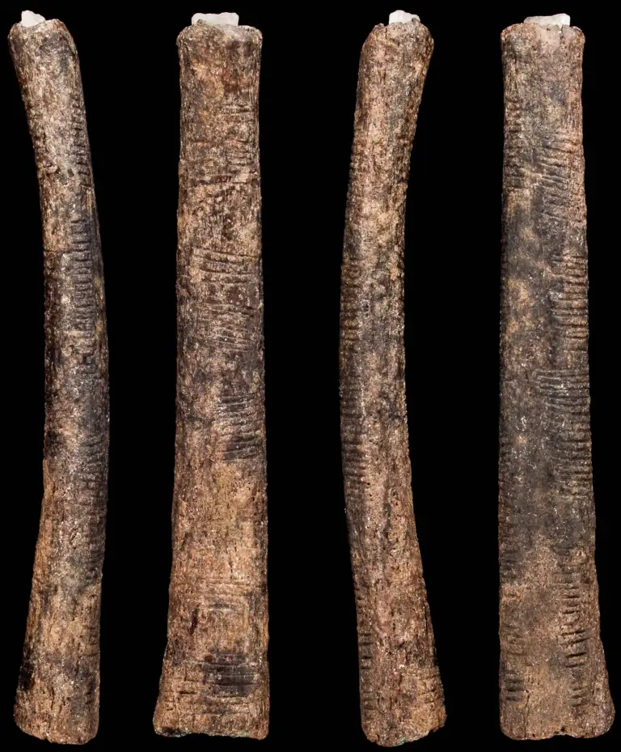
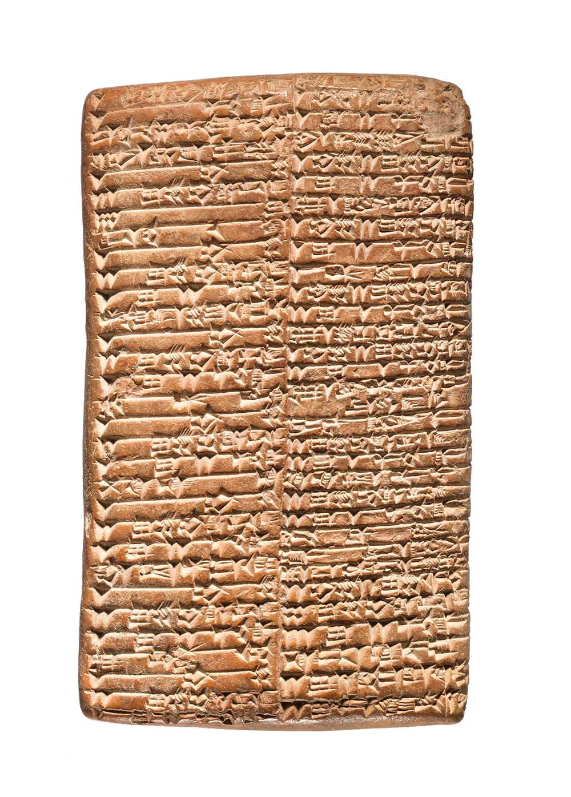
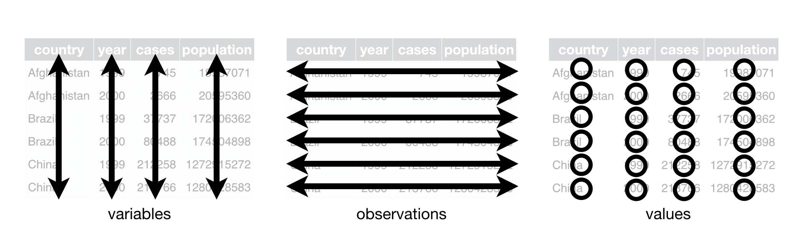

#  {background-image="images/data_trap.png" background-size="cover" style="font-size: 70%;" align="center"}

::: {.newsection style="--h1-banner-color: #000000AA;"}
Data as measurement
:::

## Data starts with counting {background-color="#000000"}


::: {.columns}
::: {.column width="40%"}
{height=600}
:::
::: {.column width="60%" style="font-size: 70%;"}
 

### Bone of Lembobo

- Oldest tally stick, 40,000 years old
- 29 marks: lunar cycle, menstrual cycle?
- ... but piece is missing, perhaps it continued counting

 

### Bone of Ishango (picture left)

- 20,000 years old
- 168 parallel notches in all, engraved on three sides, arranged in group
- Meaning remains unclear
:::
:::

## Data starts with counting {background-color="#000000"}


::: {.columns}
::: {.column width="35%"}
{height=600}
:::
::: {.column width="65%" style="font-size: 80%;"}
 

### Mesopotamia, around 3300 BC

- One of the world’s earliest civilizations: animal husbandry, cultivation of crops
- Symbolic accounting system in _cuneiform_
- Use of sexagesimal numbers with number 60 as root: twelve finger joints of one hand and five fingers of the other
:::
:::

## Stevens' levels of measurement


 

:::{.list-table}
- - scale
  - measure property
  - math operations
  - advanced operations
  - central tendency
- - nominal
  - classification, membership
  - =, ≠
  - [grouping](https://en.wikipedia.org/wiki/Group_%28mathematics%29)
  - mode
- - ordinal
  - comparison, level
  - \>, <
  - [sorting](https://en.wikipedia.org/wiki/Sorting)
  - median
- - interval
  - difference, affinity
  - +, -
  - [yardstick](https://en.wikipedia.org/wiki/Yardstick)
  - mean, deviation
- - ratio
  - magnitude, amount
  - x, /
  - [ratio](https://en.wikipedia.org/wiki/Ratio)
  - geometric mean, variation
:::

:::{.notes}

Examples interval scale
- Temperature (Celsius & Fahrenheit); Kelvin is ratio.
- Standardized test scores, e.g. IQ
- Calendar years
- Likert scale
:::

## Types of data


 

:::{.list-table style="font-size: 70%;"}
- - Type
  - Description
- - **Primary data**
  - The principal data stored e.g. in a database, for example a simple array of numbers that measures the battery of a car. The red light of the low battery indicator flashing is assumed to be an instance of primary data conveying primary information.
- - **Secondary data**
  - The converse of primary data, constituted by their absence (one could call them anti-data). You usually suspect your car battery is flat when the engine fails to make any of the usual noise. 
- - **Metadata**
  - These are indications about the nature of some other (usually primary) data. They describe properties such as location, format, updating, availability, usage restrictions, and so forth.
:::

## Types of data


 

:::{.list-table style="font-size: 70%;"}
- - Type
  - Description
- - **Operational data**
  - These are data regarding the operations of the whole data system and the systems performance. Correspondingly, operational information is information about the dynamics of an information system. Suppose the car has a yellow light that, when flashing, indicates that the car checking system is malfunctioning. The fact that the light is on may indicate that the low battery indicator is not working properly, thus undermining the hypothesis that the battery is flat.
- - **Derivative data**
  - These are data that can be extracted from some data whenever the latter are used as indirect sources in search of patterns, clues or inferential evidence about other things than those directly addressed by the data themselves, e.g. for comparative and quantitative analyses. From someones credit card bill, concerning e.g. the purchase of petrol in a certain petrol station, one may derive the information of her whereabouts at a given time. Difficult to define this category precisely.
:::

## Tidy data


 

