#  {background-image="images/DeborahLupton-Servers-Landscape-2560x3620.png" background-size="cover" style="font-size: 70%;" align="center"}

::: {.newsection style="--h1-banner-color: #6C8864AA; --h1-banner-text-color: #DFC65E"}
Designing data science & AI platforms
:::

## Our dream: a data system that just works


 

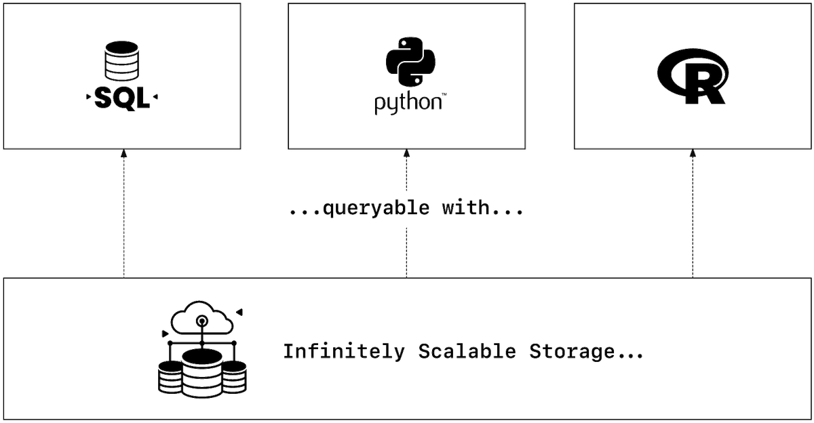

## The problem {background-color="#ffffff"}


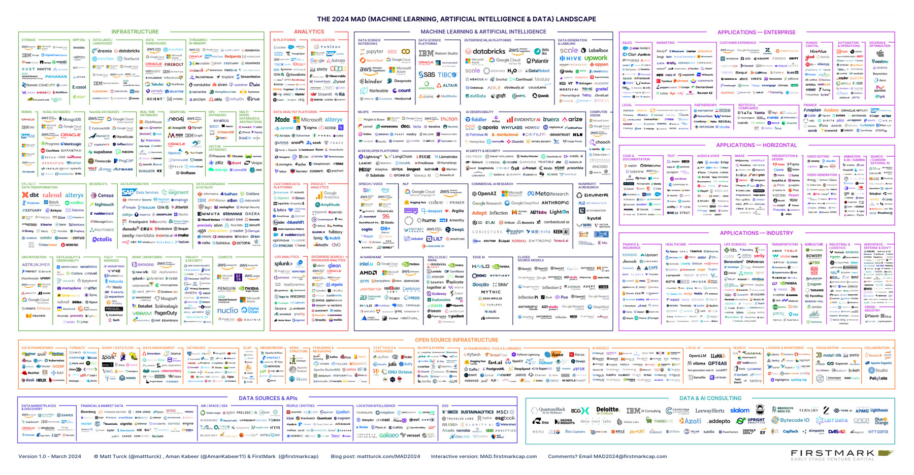

## The Composable Data Management System Manifesto


 

::: {style="font-size: 80%"}
> _The requirement for specialization in data management systems has evolved faster than our software development practices. After decades of organic growth, this situation has created a **siloed landscape** composed of hundreds of products developed and maintained as monoliths, with limited reuse between systems. This fragmentation has resulted in developers often reinventing the wheel, **increased maintenance costs, and slowed down innovation**. It has also affected the end users, who are often required to learn the **idiosyncrasies of dozens of incompatible SQL and non-SQL API dialects**, and settle for systems with incomplete functionality and inconsistent semantics._
:::

## It all started with the relational database management system (RDBMS) {background-color="#ffffff"}


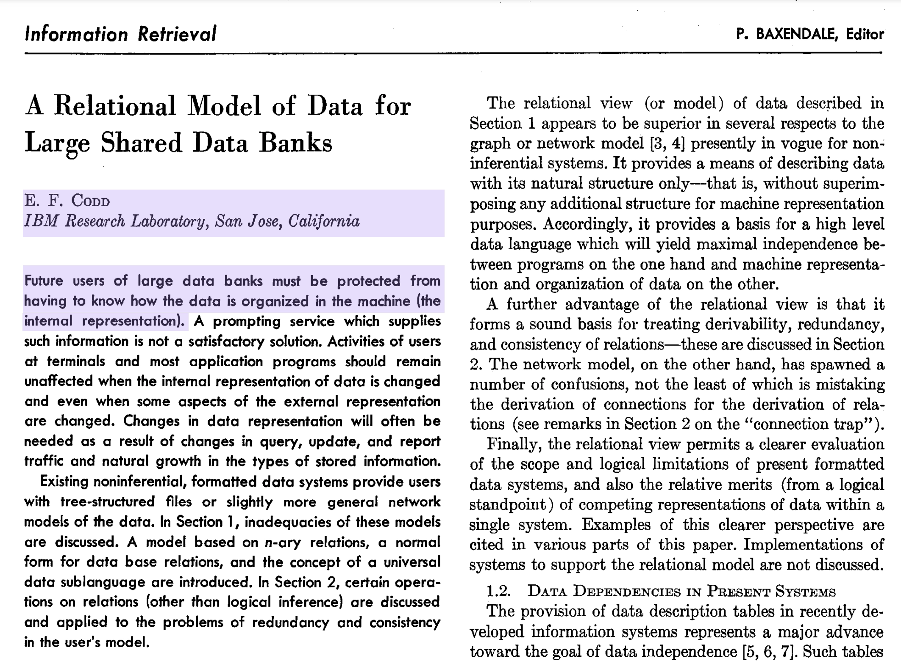

## What makes a database?

::: {.columns}
::: {.column}
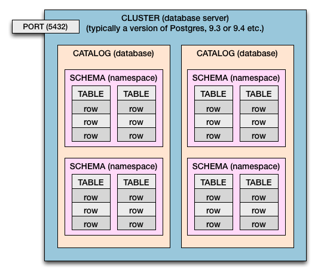
:::
::: {.column style="font-size: 80%;"}

 

| System     | Catalog  | Database   |
|------------|----------|------|
| postgresql, mysql, mssql, duckdb | database | schema     |
| datafusion, trino | catalog        | schema     |
| druid      | dataSourceType | dataSource |
| bigquery   | project        | database   |
| flink      | catalog        | database   |
| clickhouse |                | database   |
| clickhouse, impala, mysql, pyspark, snowflake |      | database   |
:::
:::

## Comparing operational and analytical data systems


::: {style="font-size: 70%;"}
|Property|Operational systems (OLTP)|Analytic systems (OLAP)|
|---|-------|------|
|Main read pattern|Point queries (fetch individual records by key)|Aggregate over large number of records|
|Main write pattern|Create, update, and delete individual records|Bulk import (ETL) or event stream|
|Human user example|End user of web/mobile application|Internal analyst, for decision support|
|Type of queries|Fixed, predefined by application|Arbitrary, ad-hoc exploration by analysts|
|Query volume|Lost of small queries|Few queries, each is complex|
|Data represents|Latest state of data (current point in time)|History of events that happened over time|
|Dataset size|Gigabytes to terabytes|Terabytes to petabytes|
:::

## Evolution of analytical system architectures


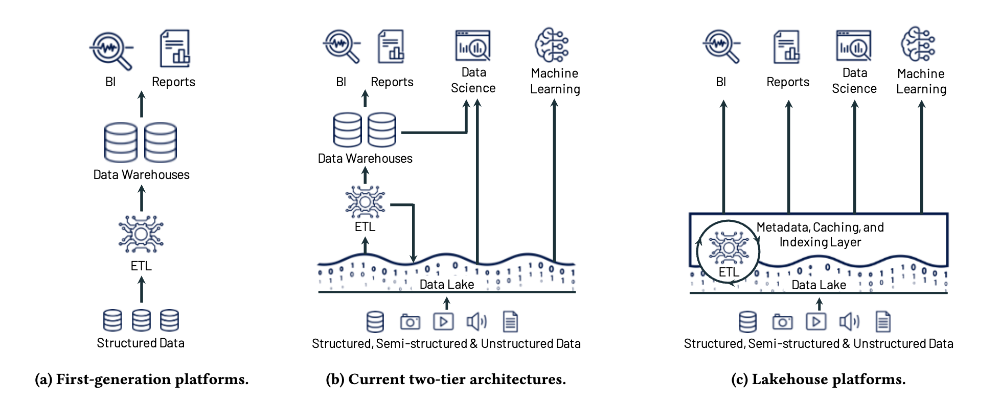

## Opening up the data warehouses


:::{style="font-size: 60%"}
::: {.list-table tbl-colwidths="[25,40,35]"}
- - Component
  - Function
  - Open source software

- - Open **query** engine
  - Parse SQL queries, optimize them into execution plans, and execute them against the data
  - [Apache DataFusion](https://datafusion.apache.org/) [Apache Spark](https://spark.apache.org/) [DuckDB](https://duckdb.org/)

- - Open **catalog** format
  - Defines which tables are contained in the database
  - [Apache Iceberg](https://iceberg.apache.org/) [Unity catalog](https://www.unitycatalog.io/) [Lance](https://lance.org/)

- - Open **table** format
  - Support row inserts and deletions
  - [Apache Iceberg](https://iceberg.apache.org/) [Lance](https://lance.org/) [Delta Lake](https://delta.io/) [Apache Hudi](https://hudi.apache.org/)

- - Open **storage** formats
  - Determines how the rows of a table are encoded as bytes in a file
  - [Apache Parquet](https://parquet.apache.org/) [Lance](https://lance.org/) [Apache Orc](https://orc.apache.org/docs/)

- - Open **memory** formats
  - Determines how the rows of a table are encoded as bytes in **memory**
  - [Apache Arrow](https://arrow.apache.org/)

:::
:::

::: {.notes}
Unbundling driven by move to the cloud

- cheap blob storage
- microservice architecture ("serverless")
:::

## From row-based to column-based systems


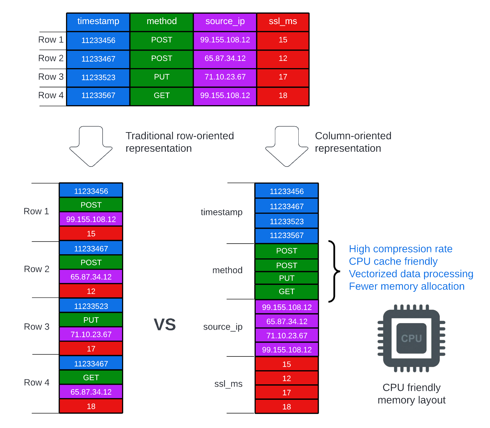

## The Composable Data Stack takes the unbundling even further


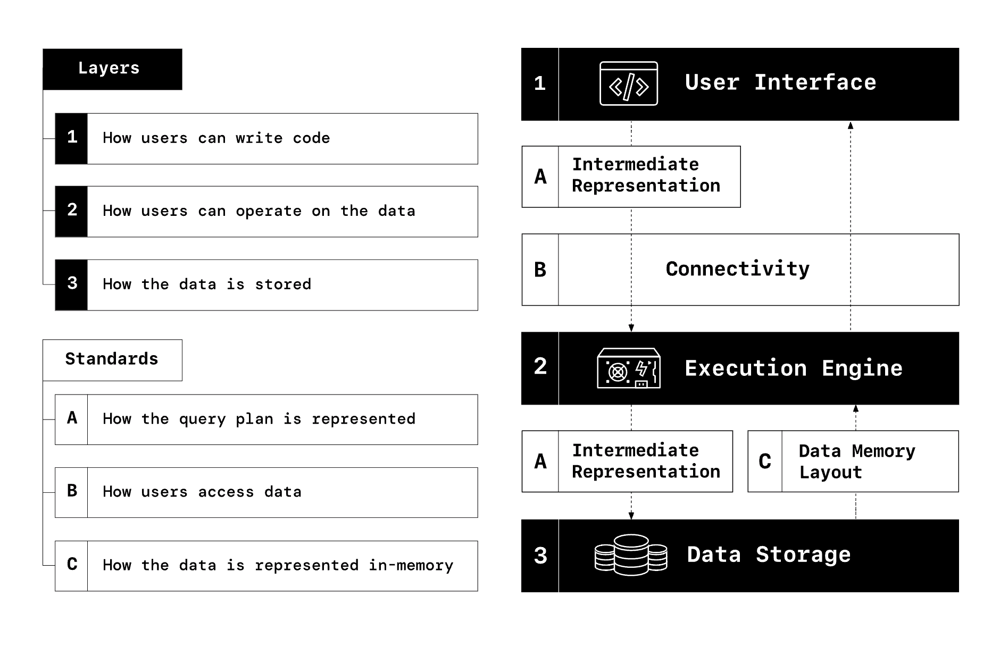

## The Composable Data Stack takes the unbundling even further


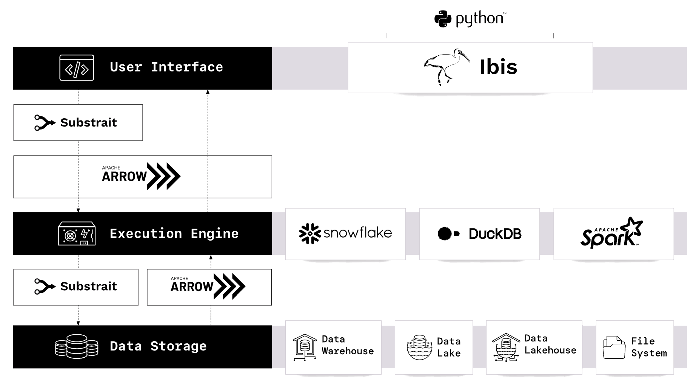

## End-to-end columnar data with Apache Arrow ADBC and Flight SQL {background-color="#ffffff"}

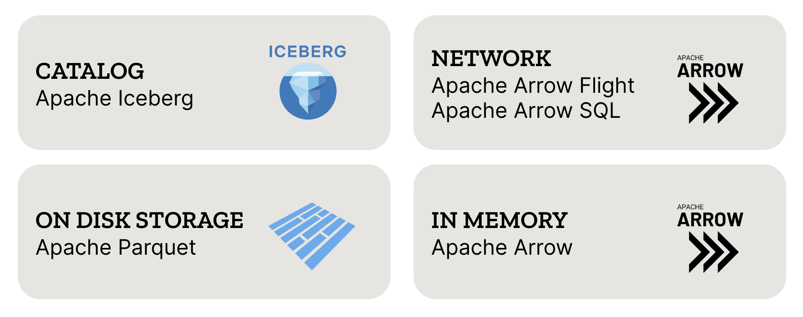

## JDBC/ODBC: row-based database connectivity protocols {background-color="#ffffff"}


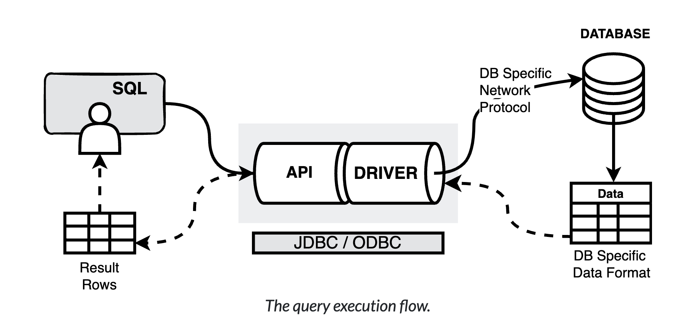

## Arrow Database Connectivity (ADBC) is column-based {background-color="#ffffff"}


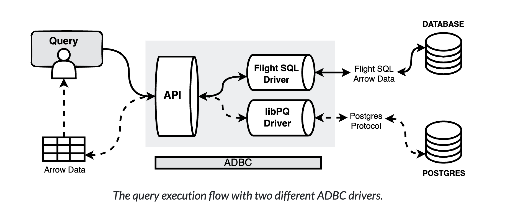

## Iceberg: an open table format and catalog {background-color="#ffffff"}


 

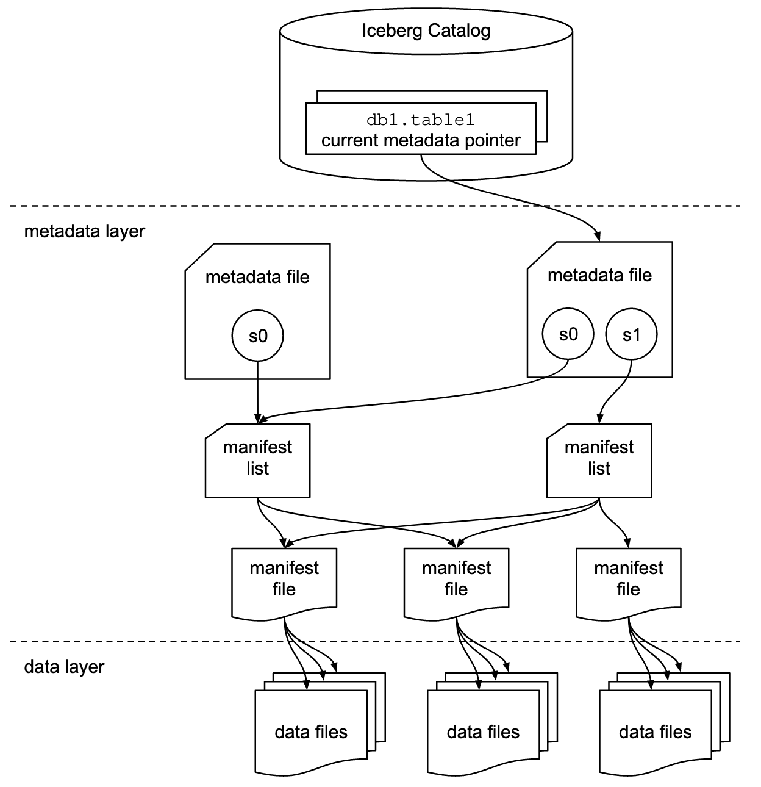

## Iceberg catalog {background-color="#ffffff"}


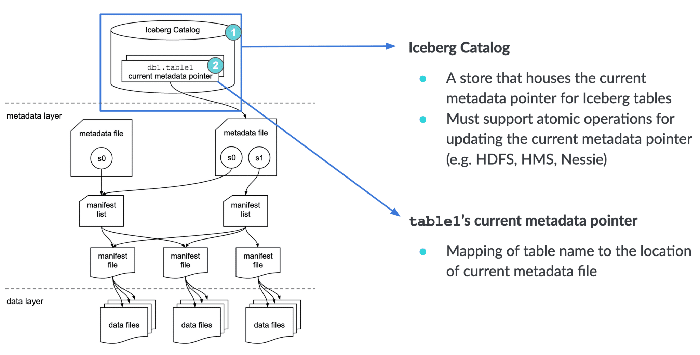

## Iceberg metadata file {background-color="#ffffff"}


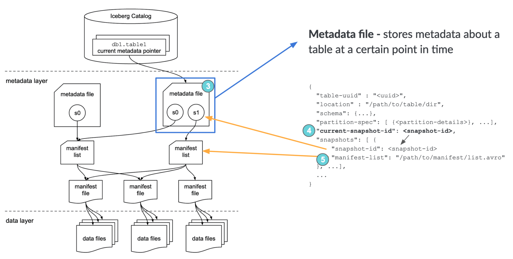

## Big Data Is Dead


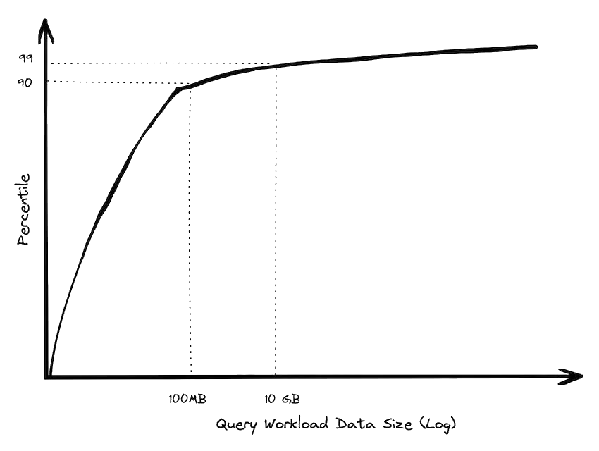{}

## The rise of embedded databases


:::{style="font-size: 60%"}
::: {.list-table}
- - Type of data
  - Open source embedable database

- - Multi-modal
  - - [LanceDB](https://www.lancedb.com/)
    - [CozoDB](https://www.cozodb.org/)

- - Relational
  - - [DuckDB](https://duckdb.org)

- - Key-value documents
  - - [RocksDB](https://rocksdb.org/)

- - Vector
  - - [Chroma](https://docs.trychroma.com/docs/overview/introduction)

- - Labeled-property graph with Cypher query engine
  - - [LadybudDB](https://ladybugdb.com/)

- - Tripe-store with SPARQL query engine
  - - [qlever](https://docs.qlever.dev/)

:::  
:::

## So has our dream come true?


## We are getting very close ... 


 

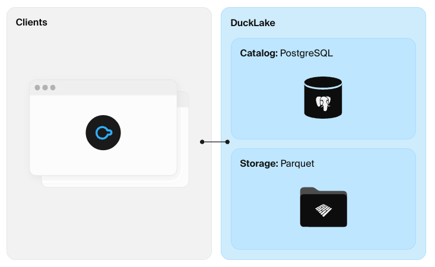{fig-align="center"}

## Diagonal scaling of a DuckLake lakehouse


::: {.columns}
::: {.column}
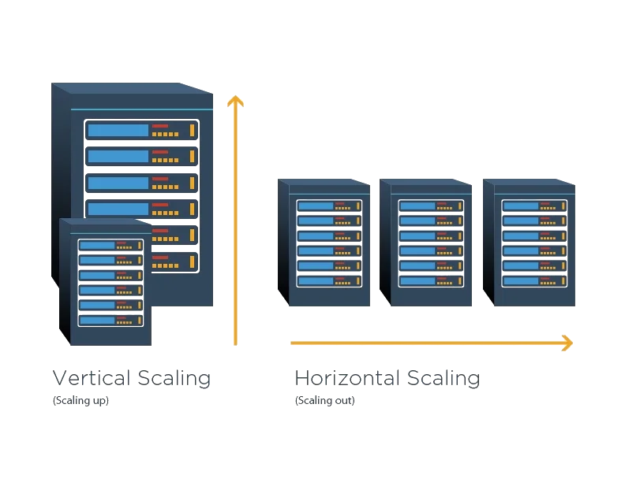
:::
::: {.column style="font-size: 80%;"}

 

- **Vertical scaling** of single node query engines that can process up to 100 TB, covering 99% of use cases
- **Horizontal scaling** of blob storage in (sovereign!) data centres

:::
:::

## From components to a whole platform architecture


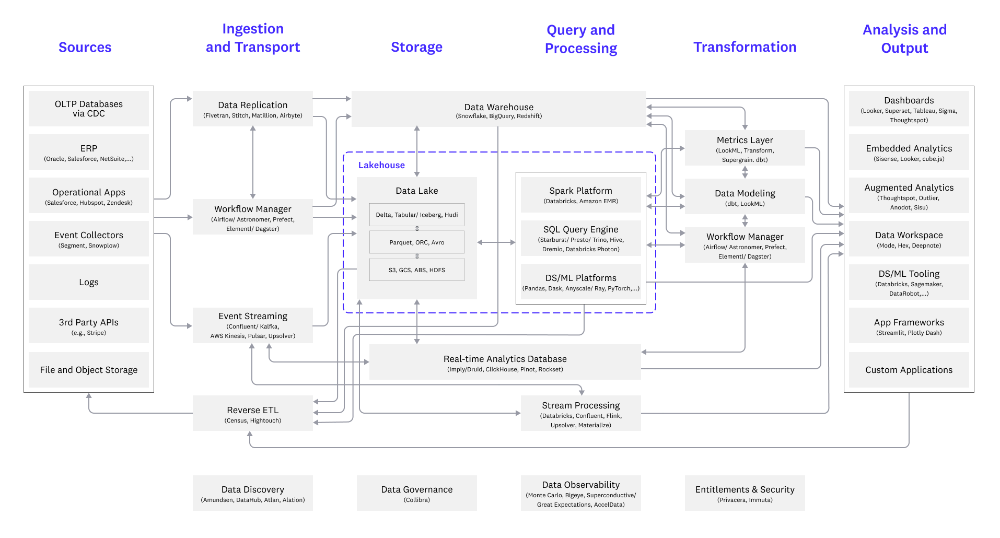

## From components to a whole platform architecture


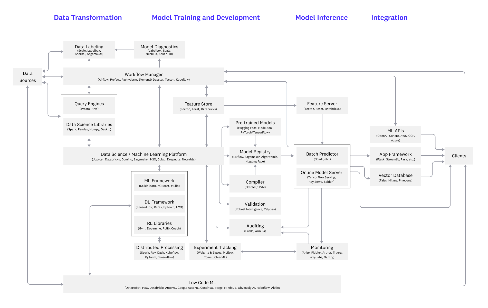

## Introducing the Single-Repo Data Platform (SRDP)


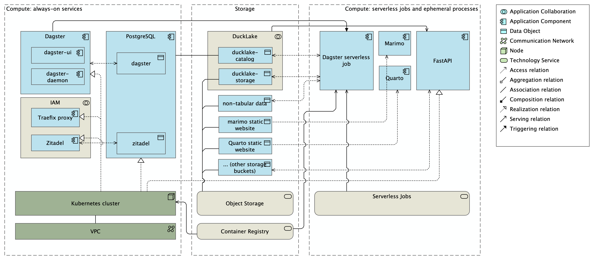