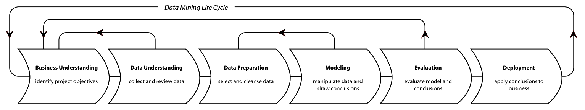
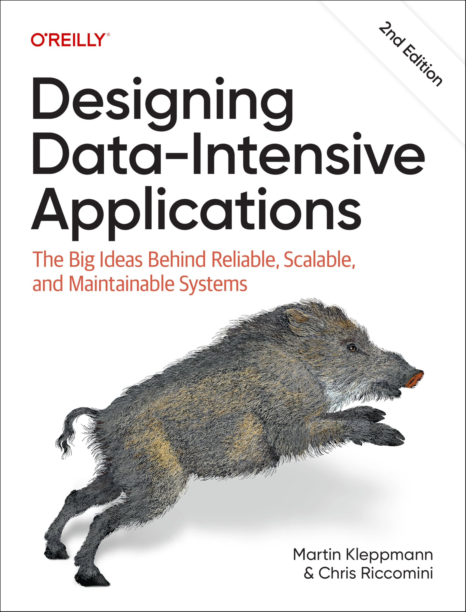
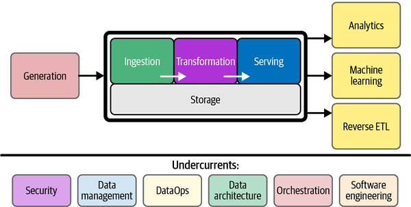

## Attribution & copyright notice

::: {style="font-size: 60%;"}

<br>
This lecture is based on the following open access materials:

- Voltron Data, [The Composable Codex](https://voltrondata.com/codex/a-new-frontier)
- Cody Peterson, [Modern, hybrid, open analytics](https://anthology-of-data.science/posts/ibis-analytics/)
- Thierry Jean, [Portable dataflows with Ibis and Hamilton](https://anthology-of-data.science/posts/hamilton-ibis/)
- Documentation of the following Python libraries: [DuckDB](https://duckdb.org/docs/), [Ibis](https://ibis-project.org), [hamilton](https://github.com/dagworks-inc/hamilton), [polars](https://docs.pola.rs/), [Shiny for Python](https://shiny.posit.co/py/)

Source code: [https://github.com/anthology-of-data-science/lecture-engineering-data-ai-platforms](https://github.com/anthology-of-data-science/lecture-engineering-data-ai-platforms)

```{=html}
<p xmlns:cc="http://creativecommons.org/ns#" >Daniel Kapitan, <em>Engineering data science & AI platforms</em>.<br>This work is licensed under <a href="https://creativecommons.org/licenses/by-sa/4.0/?ref=chooser-v1" target="_blank" rel="license noopener noreferrer" style="display:inline-block;">CC BY-SA 4.0</a></p>
```
:::


## How to manage<br>the data science lifecyclein real life?

<br><br>
{width=200% .center fig-align="center"}

:::{.notes}
Data science teams need to interact with IT:

- Design phase: solution designs / patterns
- Development phase: data science workbench, data & analytics platform
- Operational phase: maintenance monitoring
:::

## The best book on data engineering


:::: {.columns}
::: {.column width="60%" style="font-size: 50%;"}

- **Chapter 1: Tradeoffs in Data Systems Architecture**<br>_Analytical versus Operational Systems - Cloud versus Self-Hosting - Distributed versus Single-Node Systems - Data Systems, Law, and Society_
- **Chapter 2: Defining Non-Functional Requirements**<br>_Case Study: Social Network Home Timelines- Describing Performance - Reliability and Fault Tolerance - Scalability - Maintainability_
- **Chapter 3: Data Models and Query Languages**<br>_Relational Model versus Document Model - Graph-Like Data Models - Event Sourcing and CQRS - DataFrames, Matrices, and Arrays_
- **Chapter 4: Storage and Retrieval**<br>_Storage and Indexing for OLTP - Data Storage for Analytics - Multidimensional and Full-Text Indexes_
- (...)
- **Chapter 11: Batch Processing**<br>_Batch Processing in Distributed Systems - Batch Processing Models - Batch Use Cases_
:::

::: {.column width="40%"}
{fig-align="right" width=80%}
:::
::::

## The common definition of data engineering




#  {background-image="images/DeborahLupton-Servers-Landscape-2560x3620.png" background-size="cover" style="font-size: 70%;" align="center"}

::: {.newsection style="--h1-banner-color: #6C8864AA; --h1-banner-text-color: #DFC65E"}
Designing data science & AI platforms
:::

## Stages of machine learning CI/CD automation pipeline


{fig-align="center"}

## MLOps level 0 {background-color="#ffffff"}



## MLOps level 1 {background-color="#ffffff"}


{fig-align="center"}

## MLOps level 2 {background-color="#ffffff"}


:::{.notes}
The pipeline consists of the following stages:

1. Development and experimentation: You iteratively try out new ML algorithms and new modeling where the experiment steps are orchestrated. The output of this stage is the source code of the ML pipeline steps that are then pushed to a source repository.
2. Pipeline continuous integration: You build source code and run various tests. The outputs of this stage are pipeline components (packages, executables, and artifacts) to be deployed in a later stage.
3. Pipeline continuous delivery: You deploy the artifacts produced by the CI stage to the target environment. The output of this stage is a deployed pipeline with the new implementation of the model.
4. Automated triggering: The pipeline is automatically executed in production based on a schedule or in response to a trigger. The output of this stage is a trained model that is pushed to the model registry.
5. Model continuous delivery: You serve the trained model as a prediction service for the predictions. The output of this stage is a deployed model prediction service.
6. Monitoring: You collect statistics on the model performance based on live data. The output of this stage is a trigger to execute the pipeline or to execute a new experiment cycle.
:::

{fig-align="center"}

## The most complete open source MLOps library {background-color="#ffffff"}


```{.d2 theme="Terminal" layout="elk" pad=20 width="100%" sketch="true"}
direction: right
mlflow: " " {
  shape: image
  icon: https://raw.githubusercontent.com/mlflow/mlflow/refs/heads/master/assets/logo.svg
}

mlflow -> Tracking \& Experiments
mlflow -> Model Registry
mlflow -> Model Deployment
```

:::{.notes}
MLflow Tracking & Experiments:

- Experiment Organization: Track and compare multiple model experiments
- Metric Visualization: Built-in plots and charts for model performance
- Artifact Storage: Store models, plots, and other files with each run
- Collaboration: Share experiments and results across teams
:::

## MLflow Tracking & Experiments {background-color="#ffffff"}



## MLflow Model Registry {background-color="#ffffff"}



## MLflow Model Deployment {background-color="#ffffff"}



## Hidden technical debt in ML systems {background-color="#ffffff"}


```{.d2 theme="Terminal" layout="elk" pad=20 sketch="true"}
**.shape: oval
direction: right
root: Hidden technical debt in ML systems
ddd: Data dependency debt
ad: analysis debt
ap: anti-patterns

root -> ap
ap -> Abstraction debt
ap -> Glue code
ap -> Pipeline jungles
ap -> Dead experimental codepaths
ap -> Common smells

root -> ddd
ddd -> Unstable data dependencies
ddd -> Underutilized data dependencies

root -> ad
ad -> Direct feedback loop
ad -> Indirect feedback loop

root -> configuration debt
```


