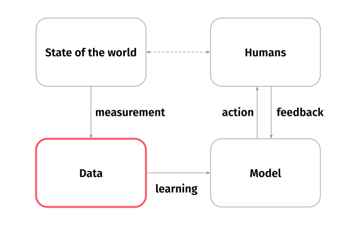
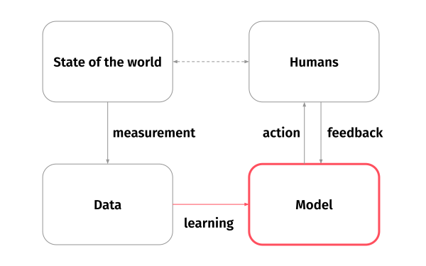
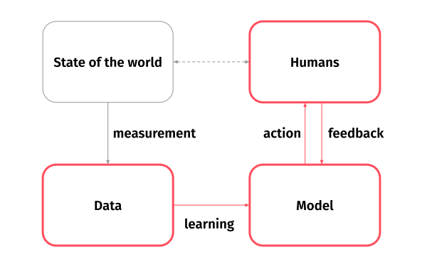
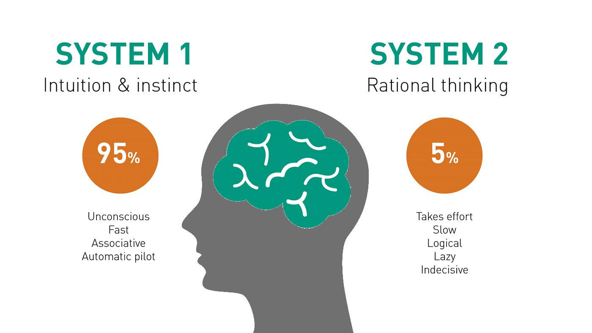

## Attribution & copyright notice

::: {style="font-size: 60%;"}

<br>
This lecture is based on many open access materials for which references are given on each slide. We highlight the following resources, which provide the backbone of the main narrative:

- L. Fioridi (2009), [Philosophical Conceptions of Information](https://www.researchgate.net/publication/220803995_Philosophical_Conceptions_of_Information)
- Voltron Data, [The Composable Codex](https://web.archive.org/web/20251208133433/https://voltrondata.com/codex)
- Documentation of the following Python libraries:<br>[DuckDB](https://duckdb.org/docs/), [polars](https://docs.pola.rs/), [Ibis](https://ibis-project.org), [dagster](https://docs.dagster.io/), [hamilton](https://github.com/dagworks-inc/hamilton), [Shiny for Python](https://shiny.posit.co/py/), [marimo](https://docs.marimo.io)
- [Better Images of AI](https://betterimagesofai.org/), for non-stereotypical and thought provoking images

Source code: [https://github.com/anthology-of-data-science/lecture-engineering-data-ai-platforms](https://github.com/anthology-of-data-science/lecture-engineering-data-ai-platforms)<br>

```{=html}
<p xmlns:cc="http://creativecommons.org/ns#" >This work is licensed under <a href="https://creativecommons.org/licenses/by-sa/4.0/?ref=chooser-v1" target="_blank" rel="license noopener noreferrer" style="display:inline-block;">CC BY-SA 4.0</a></p>
```
:::

## The scope of real-world data science



::: {.notes}
Analytical problem-solving with humans in the loop, focuses on
- business intelligence
- quantitative analysis
- storytelling with data
- learning and predicting
- reasoning and decision-making
:::

## The scope of real-world data science


:::{.columns}
:::{.column}

:::
:::{.column style="font-size: 80%;"}
<br>
**Etymology**

- _datum_: something given (fr. donné)
- _informare_: formation of the mind
- _modulus_: unit of measurement
- _gnosis_: knowledge
:::
:::

## What are data?


:::{.columns}
:::{.column}

:::
:::{.column style="font-size: 80%;"}
<br>

- Data begins with counting
- From relational databases to document databases and knowledge databases
- From data to information to knowledge
:::
:::

## But what is "learning" and what are "models"?


:::{.columns}
:::{.column}

:::
:::{.column style="font-size: 80%;"}
<br>

- Models as tools to obtain factual knowledge
- Different types of models: machine learning model, generative AI model, causal model, deductive model
- How does data science and "AI" change how we work with models?
:::
:::


## The Ladder of Causality


::: {.columns}
::: {.column width="35%"}
{height=500 }
:::
::: {.column width="65%" style="font-size: 80%;"}
<br>

### Remember:

- Machine learning models are not the only models
- Machine learning models are _only_ based on correlations
- Machine learning _can not_ reason (although LLMs look like they can)
- Read more on [analytical problem with different types of models](https://anthology-of-data.science/posts/analytical-problem-solving/)
:::
:::

## Using data and models in real-world applications


:::{.columns}
:::{.column}

:::
:::{.column style="font-size: 80%;"}
<br>

- Platforms for working with data and models
- Governance of data & models in organizations
- Ethical, legal and societal impact of using data & models
- Human-computer interactions 
:::
:::

## Thinking, Fast and Slow




:::{.notes}
- We assume models help us in making rational decisions --> we don't make rational decision
- Framing: the way data and information is presented to us has large impact on the decision we make
:::

## Engineering for data science & AI

<br>

::: {.card-grid .cols-2 style="font-size: 80%;"}
::: {.card}
**Part I**

- Data as measurement:<br>the basics of working with data
- The relational database
- Bringing semantics back<br>into data engineering
:::
::: {.card}
**Part II**

- Designing<br>data science & AI platforms
- Patterns for building<br>data & AI systems
- MLOps
:::
:::













