## Attribution & copyright notice

::: {style="font-size: 60%;"}

<br>
This lecture is based on the following open access materials:

- Voltron Data, [The Composable Codex](https://web.archive.org/web/20251208133433/https://voltrondata.com/codex)
- Documentation of the following Python libraries:<br>[DuckDB](https://duckdb.org/docs/), [polars](https://docs.pola.rs/), [Ibis](https://ibis-project.org), [dagster](https://docs.dagster.io/), [hamilton](https://github.com/dagworks-inc/hamilton), [Shiny for Python](https://shiny.posit.co/py/), [marimo](https://docs.marimo.io)

Source code: [https://github.com/anthology-of-data-science/lecture-engineering-data-ai-platforms](https://github.com/anthology-of-data-science/lecture-engineering-data-ai-platforms)<br>

```{=html}
<p xmlns:cc="http://creativecommons.org/ns#" >This work is licensed under <a href="https://creativecommons.org/licenses/by-sa/4.0/?ref=chooser-v1" target="_blank" rel="license noopener noreferrer" style="display:inline-block;">CC BY-SA 4.0</a></p>
```
:::

## The scope of real-world data science


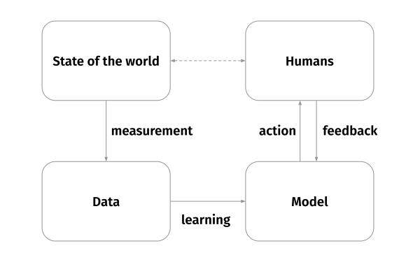

::: {.notes}
Analytical problem-solving with humans in the loop, focuses on
- business intelligence
- quantitative analysis
- storytelling with data
- learning and predicting
- reasoning and decision-making
:::

<!-- #  {background-image="images/rebecca-hesketh-semantics.png" background-size="cover" style="font-size: 70%;" align="center"}

::: {.newsection style="--h1-banner-color: #000000AA;"}
Bringing semantics back into data & AI engineering
::: -->

## From data to information and knowledge {background-color="#ffffff"}


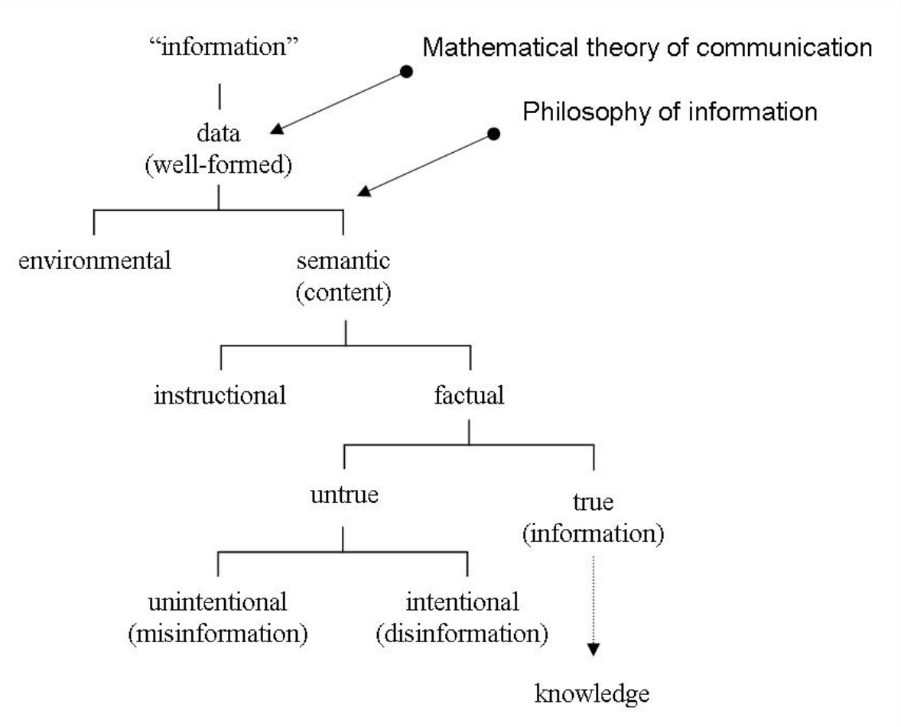

## General definition of information {background-color="#ffffff"}


<br>

### Information = Data + Meaning

- multiple data points
- data is well-formed (syntax)
- data is meaningful in a certain context (semantics)

## What is the meaning of this statement?
<br><br><br><br>

::: {style="font-size: 180%;"}
### "Daniel has a high blood pressure"
:::

## The semantics of blood pressure {background-color="#ffffff"}


<br>

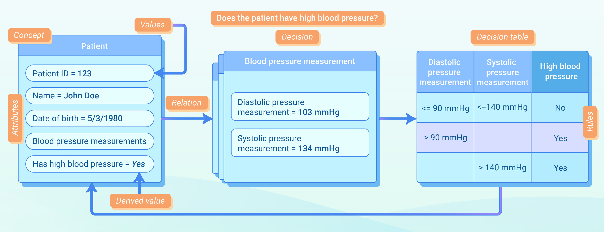

## From data to information


<br>

::: {.list-table style="font-size: 60%;"}
- - Level
  - Dimension
  - Theoretical anchor
  - Example

- - **Data**
  - Signal & Measurement
  - Data is not "raw" but produced by instruments designed under specific physical theories.
  - The voltage fluctuations from the sensor translated into a numerical output (e.g., 145/95).

- - **Information (Statistical)**
  - Entropy & Surprise
  - Shannon Information Theory: The statistical novelty or reduction of uncertainty within a signal, regardless of meaning.
  - A reading of 145 mmHg is "surprising" (high information content) if the patient's historical baseline is 120 mmHg.

- - **Information (Semantic)**
  - Context & Relations
  - Ontologies & Knowledge Graphs: Data structured via schemas to provide meaning (units, subjects, and temporal states).
  - Linking the "145" to "mmHg," "Patient X," and "Resting State" within a standardized medical ontology.

:::

## ... and from information to knowledge


<br>

::: {.list-table style="font-size: 60%;"}
- - Level
  - Dimension
  - Theoretical anchor
  - Example

- - **Knowledge (Propositional)**
  - Justified True Belief (JTB)
  - Classical Epistemology: Knowledge-that. A claim that is believed, is true, and has rigorous justification.
  - The clinician’s belief that "Patient X has hypertension," justified by multiple readings and clinical guidelines.

- - **Knowledge (Procedural)**
  - Non-Propositional Skill
  - Ryle’s "Knowledge-How": The tacit ability to perform a task that cannot be fully captured in formal data structures.
  - The nurse’s skill in correctly placing the cuff and identifying the specific Korotkoff sounds amidst noise.

- - **Knowledge (Acquaintance)**
  - Personal experience
  - familiarity with a person, place, or thing
  - The nurse is familiar with the hospital
:::

## But what is "learning" and what are "models"?


::: {.columns}
::: {.column}
<br>

- Machine learning model
- Generative large language model
- Logical reasoning model
- Physical model
- Data model
- ...


:::
::: {.column}
<br>

:::
:::

## The Ladder of Causality



::: {.columns}
::: {.column}

{height=500}
:::
::: {.column}
<br>

### Always remember:

- Machine learning models are not the only models
- Machine learning models are _only_ based on correlations
- Machine learning _can not_ reason (although LLMs look like they can)
:::
:::

## Diving into data: different approaches to data modeling

<br>

- The basics: relational modeling
- Bringing back semantics to data: the ontology pipeline
- Comparison of different data models & query languages

## It all started with the relational database management system (RDBMS) {background-color="#ffffff"}


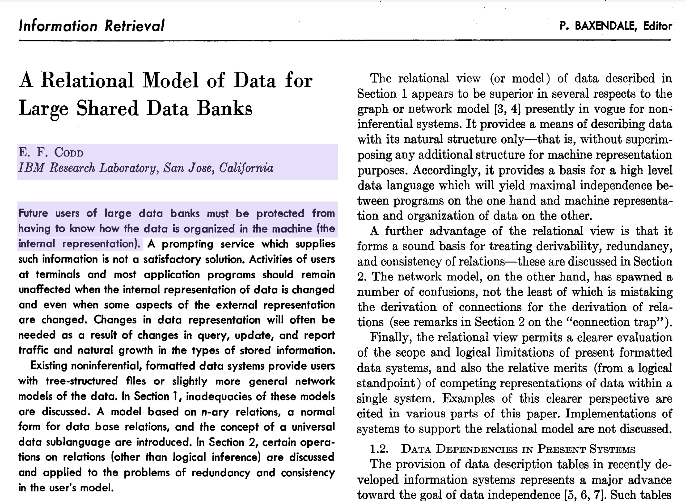

## Databases are often at the heart of an information system {background-color="#ffffff"}

<br>

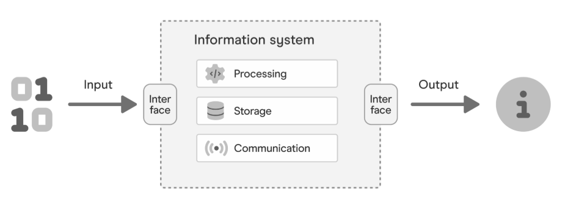


## Databases are often at the heart of an information system {background-color="#ffffff"}

<br>

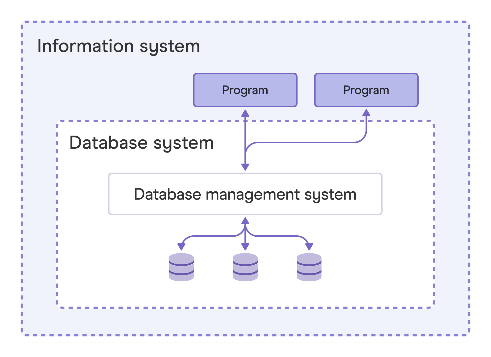

## Relational algebra as the mathematical foundation


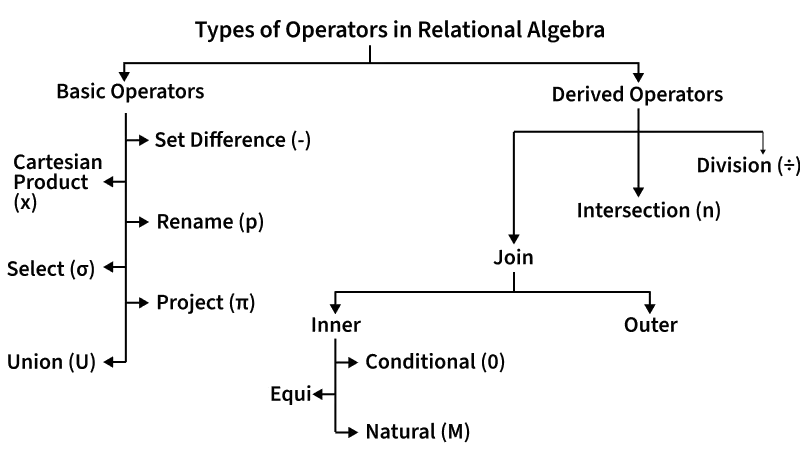


## Consider this description of our domain of interest

::: {style="font-size: 80%;"}
- Our company is divided into departments. Each department has a unique name, a unique department number and a department manager. The date this manager started, is registered. Furthermore, a department can be located on multiple locations.
- All employees work for a specific department. Almost everyone has one supervisor, a supervisor may have several employees he is supervisor of. Every employee has a unique number, a name, a birth date, a gender, and a home address.
- An employee works in one of more projects. Each project is controlled by one department, has a unique name and number and is settled on a location. Project members do not necessarily have to work fulltime for a project, but usually a fixed number of hours per week.
- An employee may have several persons that are economically dependent on him: children and/or a spouse/husband. These can be identified by name, have a birth date and a gender. The sort of relationship is denoted as well.
:::

## Chen notation {background-color="#ffffff"}

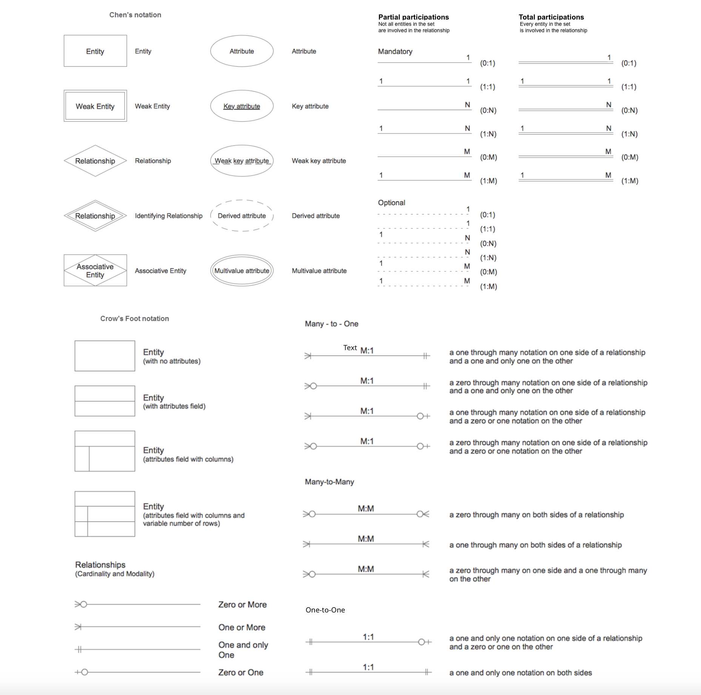

## Solution {background-color="#ffffff"}

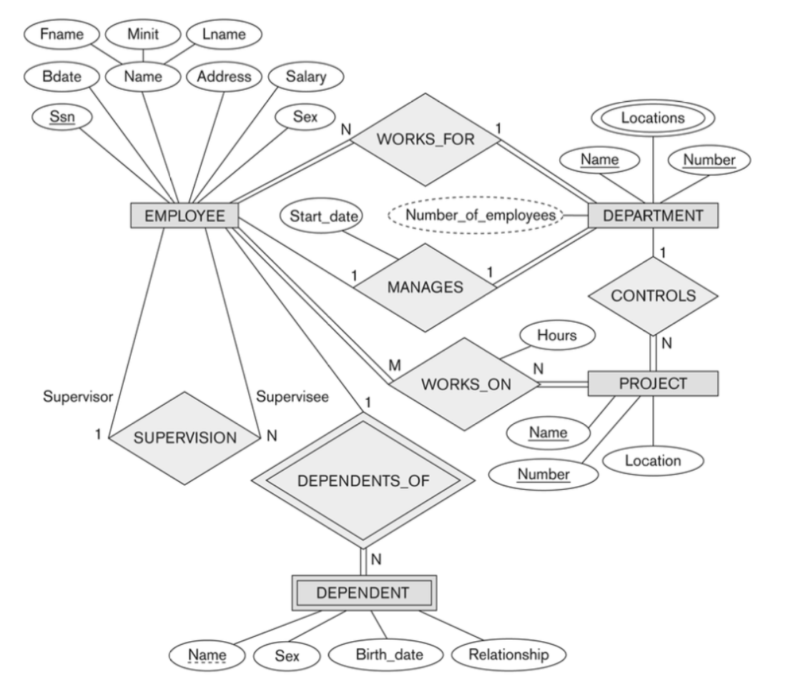

## Relational models in datawarehouses: the dimensional model (aka star schema)


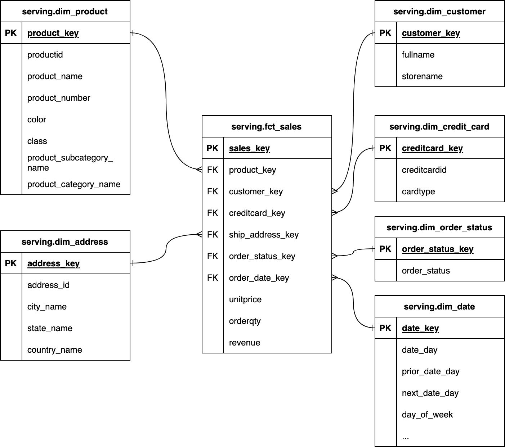

## Relational models in datawarehouses: the data vault


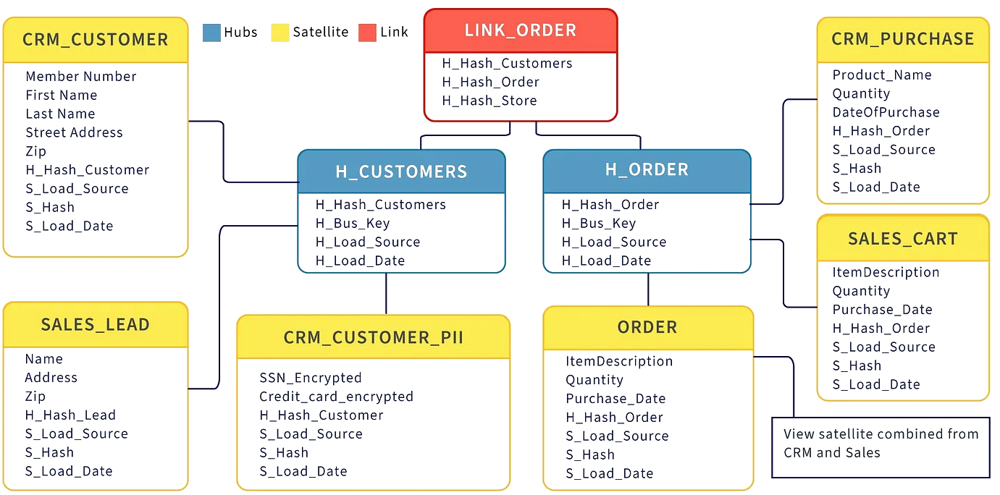

## But relational modeling alone is not enough

<br>

### How would you define a customer?

- A person, a company?
- Based on order history, since when?
- Difference between an 'occasional' customer vs a 'loyal' customer?
- Someone who has ordered but payment is done by someone ele?
- ...

## KIK-V ontology for the Dutch care sector {background-color="#ffffff"}


```{=html}
<iframe width="1200" height="500" src="https://kik-v-publicatieplatform.nl/ontologie/onz-pers/3.0.0"></iframe>
```

## The Ontology Pipeline


:::{.columns}
:::{.column}
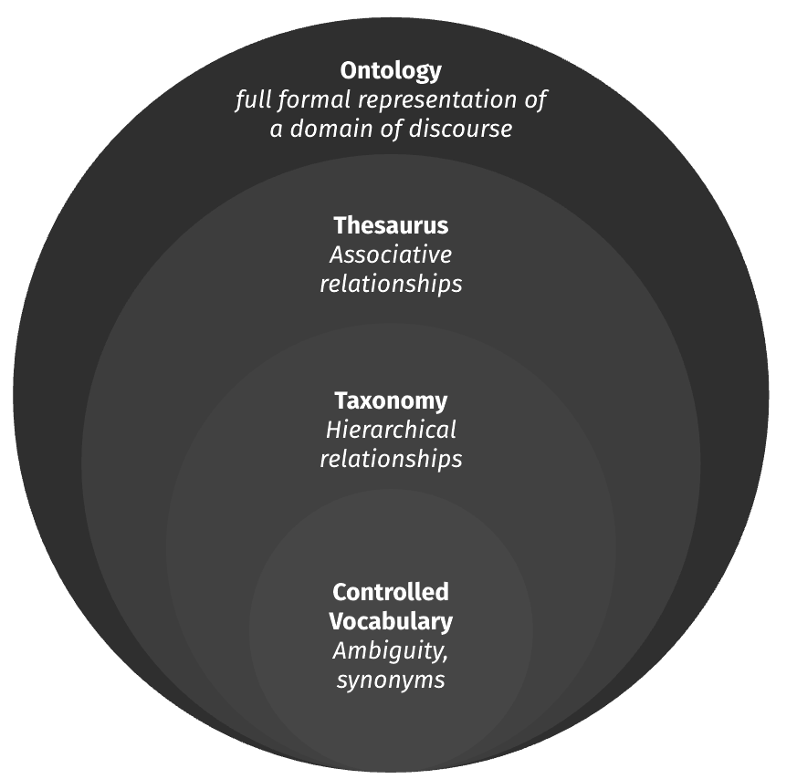
:::
:::{.column style="font-size: 70%;"}
**Ontologies** enhance **vocabularies** by describing and contextualizing relationships between concepts and with the introduction of logical reasoning. By assigning classes, properties, relations and attributes, ontologies establish rule bases that define how concepts behave in the wild, ensuring a level of coherence within complex information systems. Machines love ontologies because of their high-fidelity disambiguation and description, which bring clarity to machine understanding for tasks such as information retrieval, entity management, concept discovery, and RAG implementations for AI systems.
:::
:::

## Are graphs the future?

:::{style="font-size: 70%;"}
<br>

### I certainly think so

- Read this comprehensive introduction by [Hogan et al. (2021)](https://dl.acm.org/doi/pdf/10.1145/3447772)
- Labeled property graph (cypher/GQL): try the [neo4j sandbox](https://neo4j.com/sandbox/)
- RDF Triple Store (SPARQL): try the [data.world SPARQL tutorial](https://neo4j.com/sandbox/)

:::{.callout-caution}
- The RDF/SPARQL stack is mostly used by the ontology community
- Labeled Property Graphs as more commonly used by companies
- [Graph Query Language GQL](https://www.gqlstandards.org/) is the new ISO standard, similar to SQL and derived from cypher (neo4j)
- There is also [GraphQL](https://graphql.org/), which is an API format and something completely different from GQL
:::

:::

## SPARQL vs. Cypher/GQL comparison


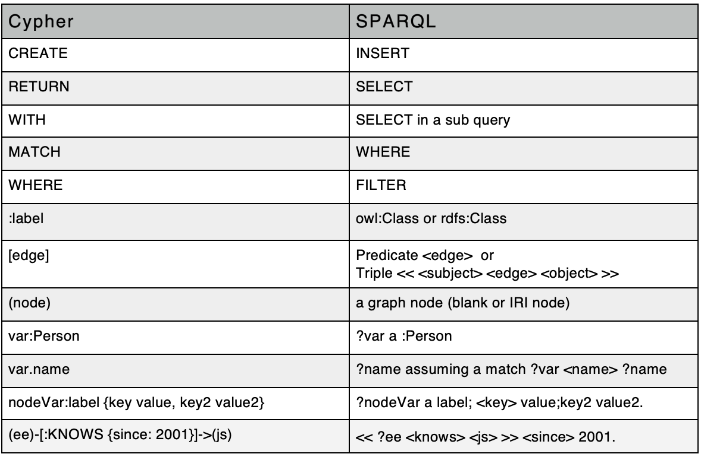

## Choose your data structure and engine wisely


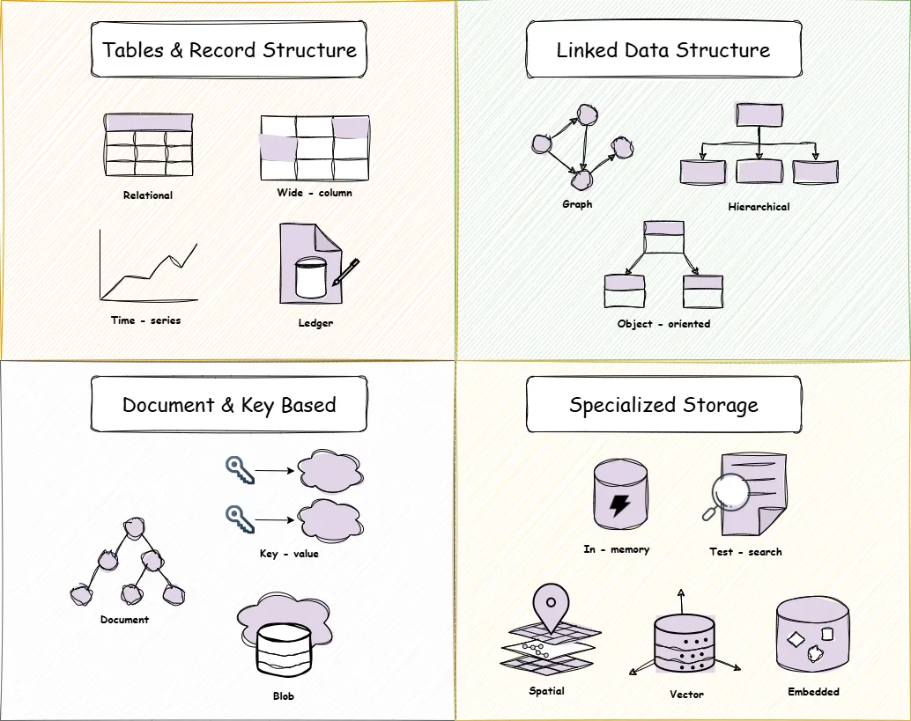

## The elephant is your friend


:::{.columns}
:::{.column}
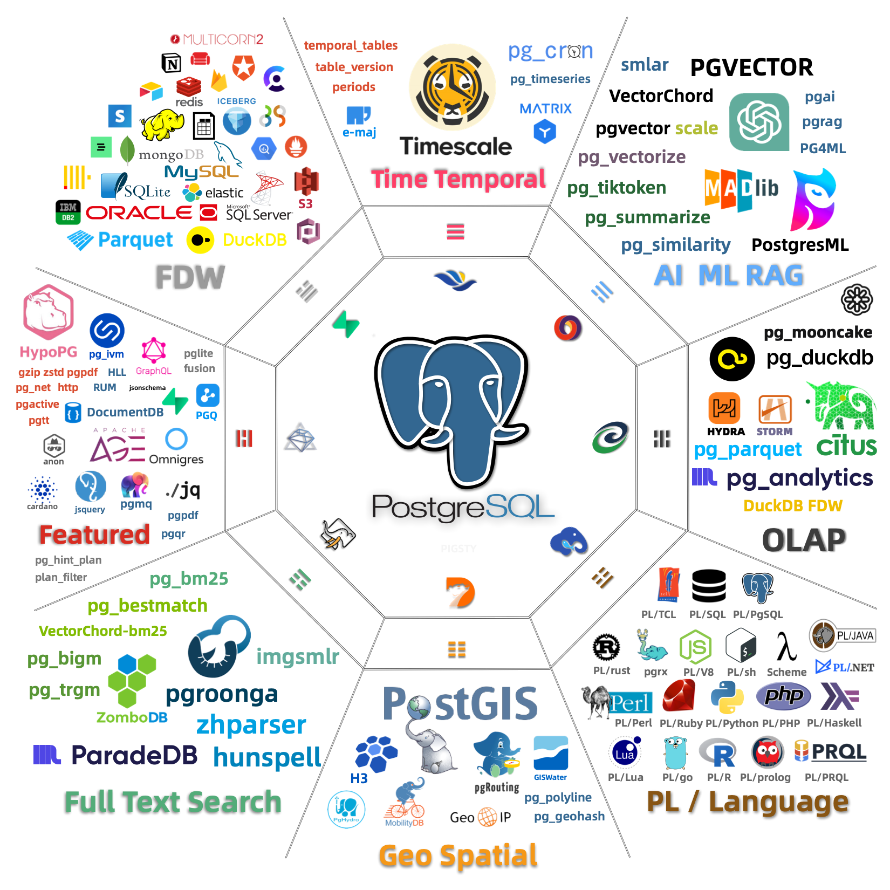
:::
:::{.column style="font-size: 70%;"}

<br>

- **One physical engine:** PostgreSQL is the most widely used open source relational database management system
- **Supports different data structures:** not only relational but also document model ([JSONB](https://neon.com/guides/document-store)) and labeled property graph ([Apache AGE](https://age.apache.org/))
- … plus many use-case specific extensions such as time-series database, spatial database etc.
:::
:::

## How to manage<br>the data science lifecycle in real life?

<br><br>
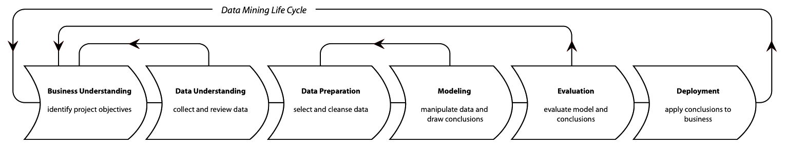{width=200% .center fig-align="center"}

:::{.notes}
Data science teams need to interact with IT:

- Design phase: solution designs / patterns
- Development phase: data science workbench, data & analytics platform
- Operational phase: maintenance monitoring
:::

## The best book on data engineering


:::: {.columns}
::: {.column width="60%" style="font-size: 50%;"}

- **Chapter 1: Tradeoffs in Data Systems Architecture**<br>_Analytical versus Operational Systems - Cloud versus Self-Hosting - Distributed versus Single-Node Systems - Data Systems, Law, and Society_
- **Chapter 2: Defining Nonfunctional Requirements**<br>_Case Study: Social Network Home Timelines- Describing Performance - Reliability and Fault Tolerance - Scalability - Maintainability_
- **Chapter 3: Data Models and Query Languages**<br>_Relational Model versus Document Model - Graph-Like Data Models - Event Sourcing and CQRS - DataFrames, Matrices, and Arrays_
- **Chapter 4: Storage and Retrieval**<br>_Storage and Indexing for OLTP - Data Storage for Analytics - Multidimensional and Full-Text Indexes_
- (...)
- **Chapter 11: Batch Processing**<br>_Batch Processing in Distributed Systems - Batch Processing Models - Batch Use Cases_
:::

::: {.column width="40%"}
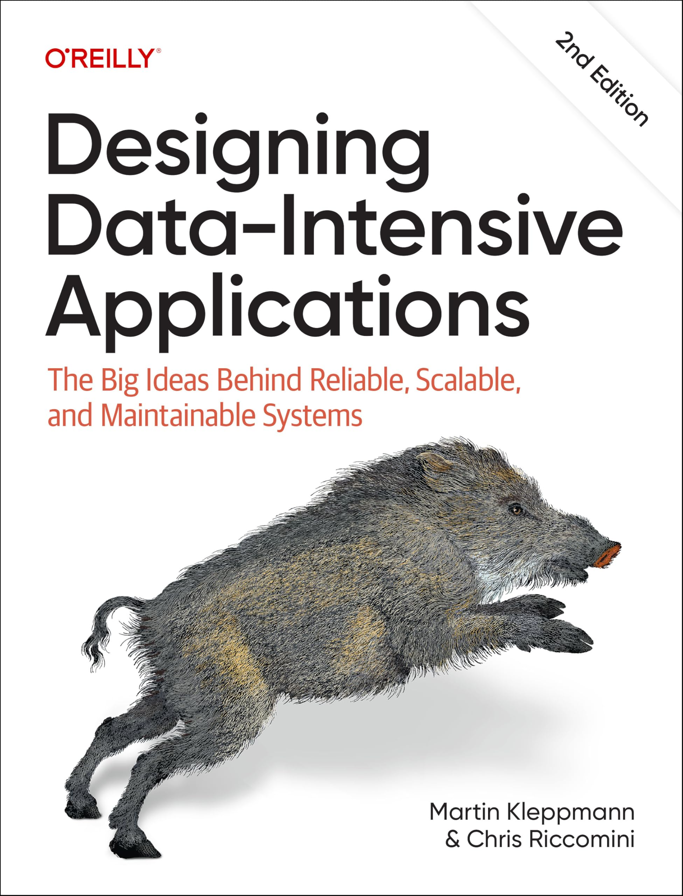{fig-align="right" width=80%}
:::
::::

## The common definition of data engineering


<br>
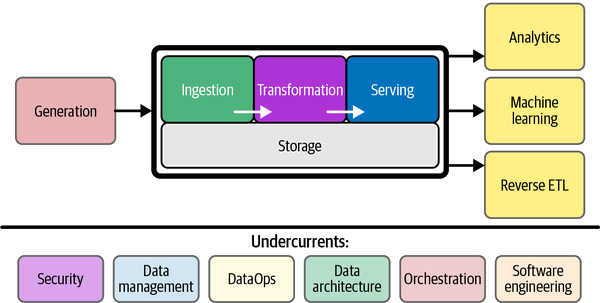{.nostretch fig-align="center" style="display:block; margin-left:auto; margin-right:auto;"}






