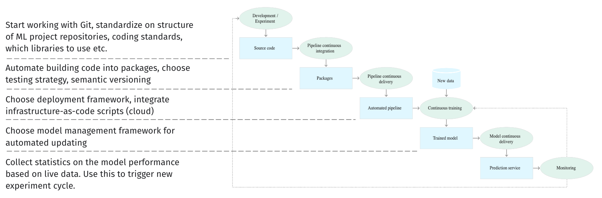
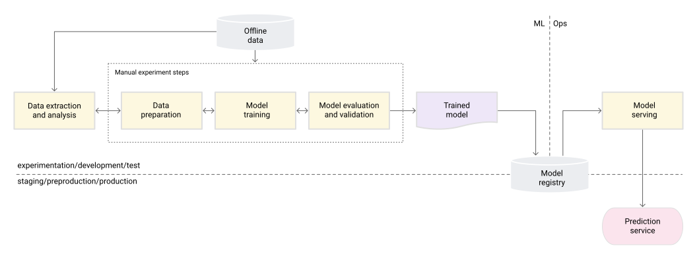
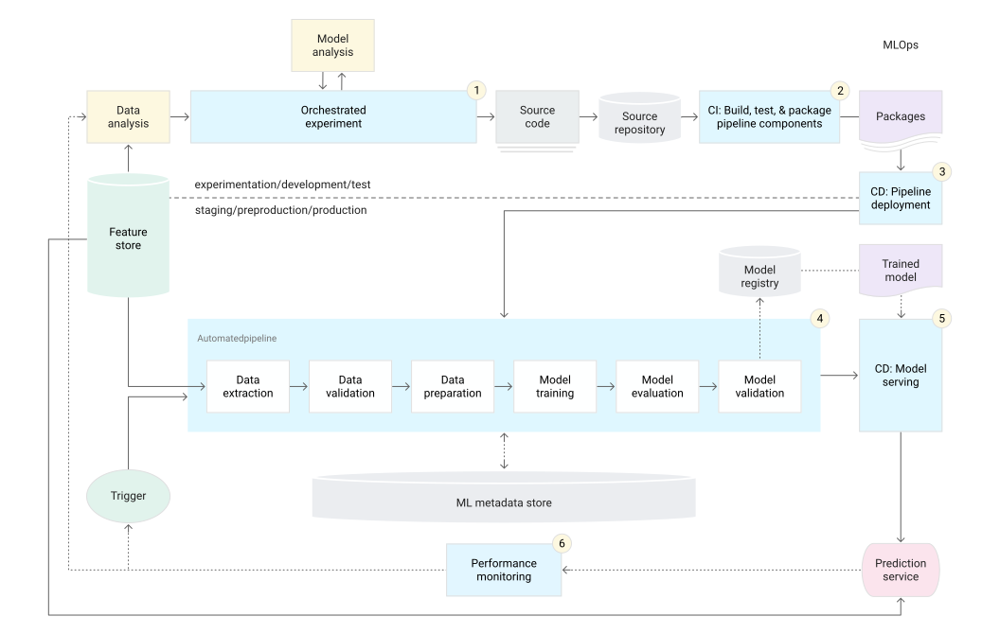
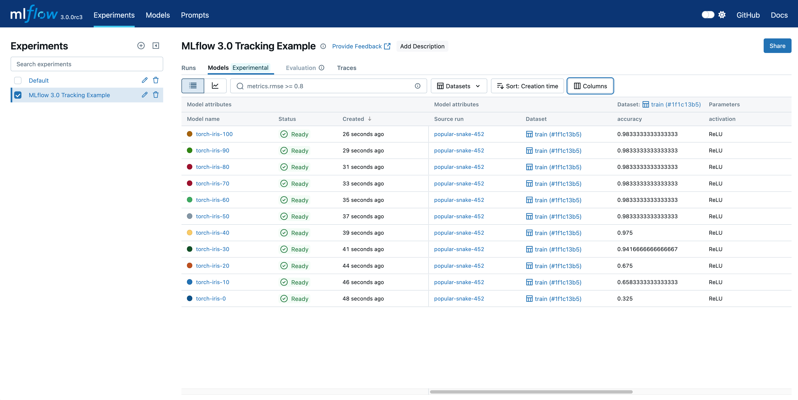
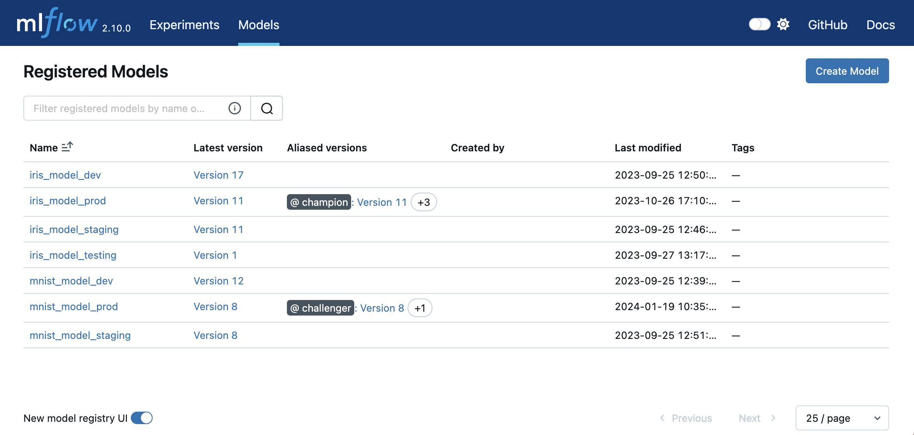
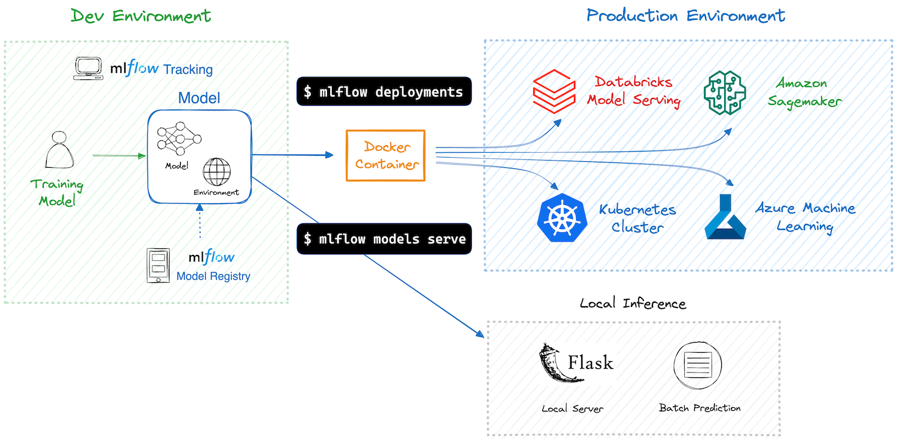

#  {background-image="images/DeborahLupton-Servers-Landscape-2560x3620.png" background-size="cover" style="font-size: 70%;" align="center"}

::: {.newsection style="--h1-banner-color: #6C8864AA; --h1-banner-text-color: #DFC65E"}
MLOps
:::

## Stages of machine learning CI/CD automation pipeline


{fig-align="center"}

## MLOps level 0 {background-color="#ffffff"}




## MLOps level 1 {background-color="#ffffff"}


{fig-align="center"}

## MLOps level 2 {background-color="#ffffff"}


:::{.notes}
The pipeline consists of the following stages:

1. Development and experimentation: You iteratively try out new ML algorithms and new modeling where the experiment steps are orchestrated. The output of this stage is the source code of the ML pipeline steps that are then pushed to a source repository.
2. Pipeline continuous integration: You build source code and run various tests. The outputs of this stage are pipeline components (packages, executables, and artifacts) to be deployed in a later stage.
3. Pipeline continuous delivery: You deploy the artifacts produced by the CI stage to the target environment. The output of this stage is a deployed pipeline with the new implementation of the model.
4. Automated triggering: The pipeline is automatically executed in production based on a schedule or in response to a trigger. The output of this stage is a trained model that is pushed to the model registry.
5. Model continuous delivery: You serve the trained model as a prediction service for the predictions. The output of this stage is a deployed model prediction service.
6. Monitoring: You collect statistics on the model performance based on live data. The output of this stage is a trigger to execute the pipeline or to execute a new experiment cycle.
:::

{fig-align="center"}

## The most complete open source MLOps library {background-color="#ffffff"}


```{.d2 theme="Terminal" layout="elk" pad=20 width="100%" sketch="true"}
direction: right
mlflow: " " {
  shape: image
  icon: https://raw.githubusercontent.com/mlflow/mlflow/refs/heads/master/assets/logo.svg
}

mlflow -> Tracking \& Experiments
mlflow -> Model Registry
mlflow -> Model Deployment
```

:::{.notes}
MLflow Tracking & Experiments:

- Experiment Organization: Track and compare multiple model experiments
- Metric Visualization: Built-in plots and charts for model performance
- Artifact Storage: Store models, plots, and other files with each run
- Collaboration: Share experiments and results across teams
:::

## MLflow Tracking & Experiments {background-color="#ffffff"}




## MLflow Model Registry {background-color="#ffffff"}




## MLflow Model Deployment {background-color="#ffffff"}




## Hidden technical debt in ML systems {background-color="#ffffff"}


```{.d2 theme="Terminal" layout="elk" pad=20 sketch="true"}
**.shape: oval
direction: right
root: Hidden technical debt in ML systems
ddd: Data dependency debt
ad: analysis debt
ap: anti-patterns

root -> ap
ap -> Abstraction debt
ap -> Glue code
ap -> Pipeline jungles
ap -> Dead experimental codepaths
ap -> Common smells

root -> ddd
ddd -> Unstable data dependencies
ddd -> Underutilized data dependencies

root -> ad
ad -> Direct feedback loop
ad -> Indirect feedback loop

root -> configuration debt
```


