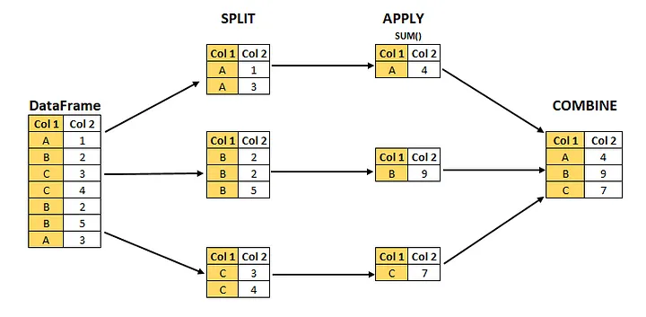
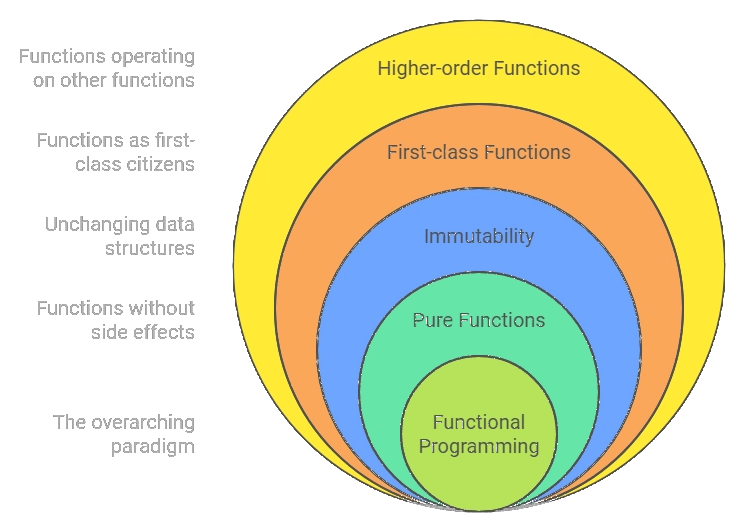
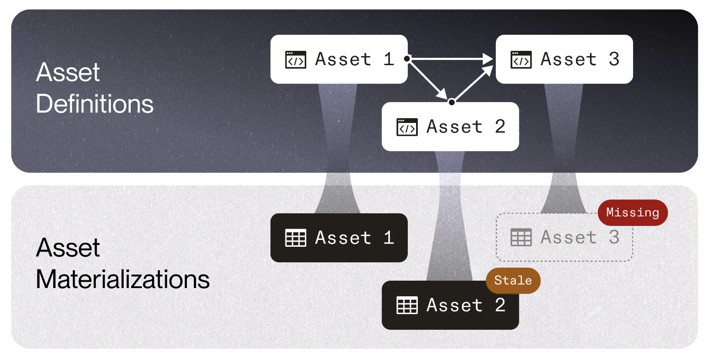

#  {background-image="images/data-processing.png" background-size="cover" style="font-size: 70%;" align="center"}

::: {.newsection style="--h1-banner-color: #E0E5E1AA; --h1-banner-text-color: #222222"}
Patterns for building data & AI systems
:::

## The most common patterns for building data & AI systems


<br>

- **Pipes and filters pattern** for building data processing flows
- **Layers pattern** for achieving interoperability
- **the hub-and-spoke event broker topology pattern** for federated data systems

## ETL, ELT, DAGs, pipelines, dataflows: it's all the same



## Business process models are also directed acyclic graphs


<br>


## Batch data processing has a strong functional flavour



::: {.notes}

> Batch processing has a quite strong functional flavor (even if the code is not written in a functional programming language). It encourages deterministic, pure functions whose output depends only on the input and that have no side effects other than the explicit outputs, treating inputs as immutable and outputs as append-only. - Kleppmann & Riccomini, chapter 13

:::

## The split-apply-combine strategy for data analysis


<br>




##  Overview data transformations in different libraries

::: {style="font-size: 80%;"}

| concept | pandas | polars | ibis | PySpark | dplyr | SQL |
| --- | --- | ---| --- | --- | --- | --- |
| **split** | groupby() | group_by() | group_by() | groupBy() | group_by() | GROUP BY |
| **combine** | join (), merge() | join() | left_join, inner_join() etc. |  join() | left_join, inner_join() etc. | LEFT JOIN, JOIN etc. |
| **filtering (row based)**| loc[], query() | filter() | filter() | filter() | filter() | WHERE | 
| **select (column based)**| loc[], iloc[],| select() | select() | select() | select() | SELECT | 
| **mutate** | assign() | with_columns() | mutuate() | withColumn() | mutate() | ADD | 
| **ordering** | sort_values() | sort() | order_by() | orderBy() | arrange() | ORDER BY |

:::
## Method chaining makes functional code more readable


<br>

::: {.card-grid .cols-2}
::: {.card style="font-size: 75%;"}

```python
tumble_after(
    broke(
        fell_down(
            fetch(went_up(jack_jill, "hill"), "water"),
            jack),
        "crown"),
    "jill"
)
```
:::
::: {.card style="font-size: 75%;"}
```python
(jack_jill
  .went_up("hill")
  .fetch("water")
  .fell_down("jack")
  .broke("crown")
  .tumble_after("jill")
)
```
:::
:::

## Functional programming



## Imperative vs. declarative programming

## Idempotency

## Immutability: table partitions as immutable objects


## Introducting Software-Defined Assets




## Software-Defined Assets bring it all together


:::{style="font-size: 65%;"}
- **Declarative Nature:** declare the end state of an asset, orchestrator takes care of the execution. Shifts the focus from task execution to asset production.
- **Observability and Scheduling:** enhanced observability into your data assets and allow for advanced scheduling. Easier to understand the state of your assets and when they should be updated.
- **Environment Agnosticism:** environment-agnostic, same asset definitions can be used across different environments, such as development and production, without changes to the asset code.
- **Data Lineage:** clear data lineage, easier to understand data flows and debug issues.
- **Integration with External Tools:** the orchestrator can be integrated with assets generated by other tools such as dbt.
- **Rich Metadata and Grouping:** assets have rich metadata, which is useful for organizing and searching assets.
- **Partitioning and Backfills:** SDAs support time partitioning and backfills out of the box, which is useful for managing historical data and ensuring data consistency.
:::

## Same workflow for machine learning pipelines

