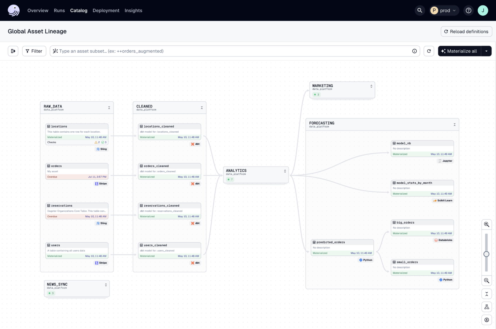
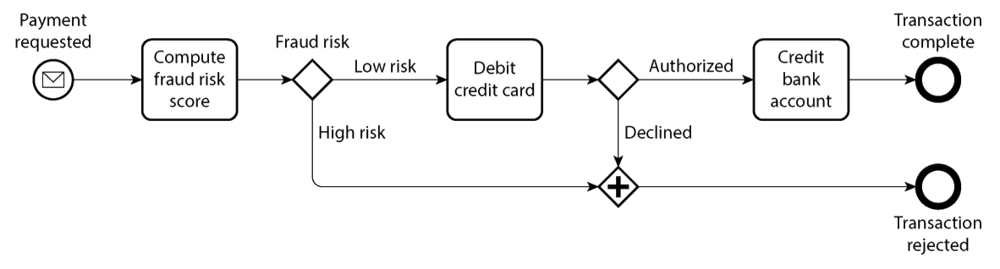
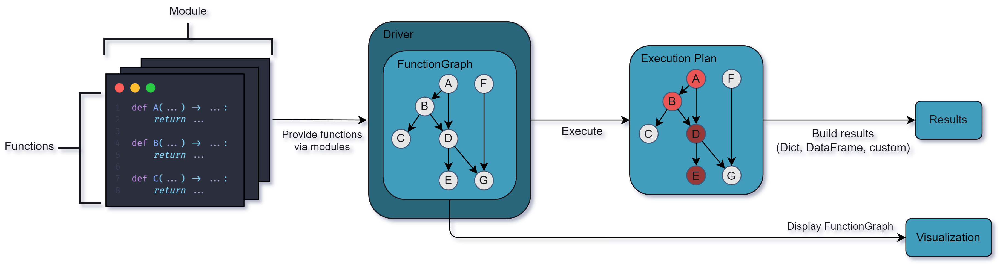
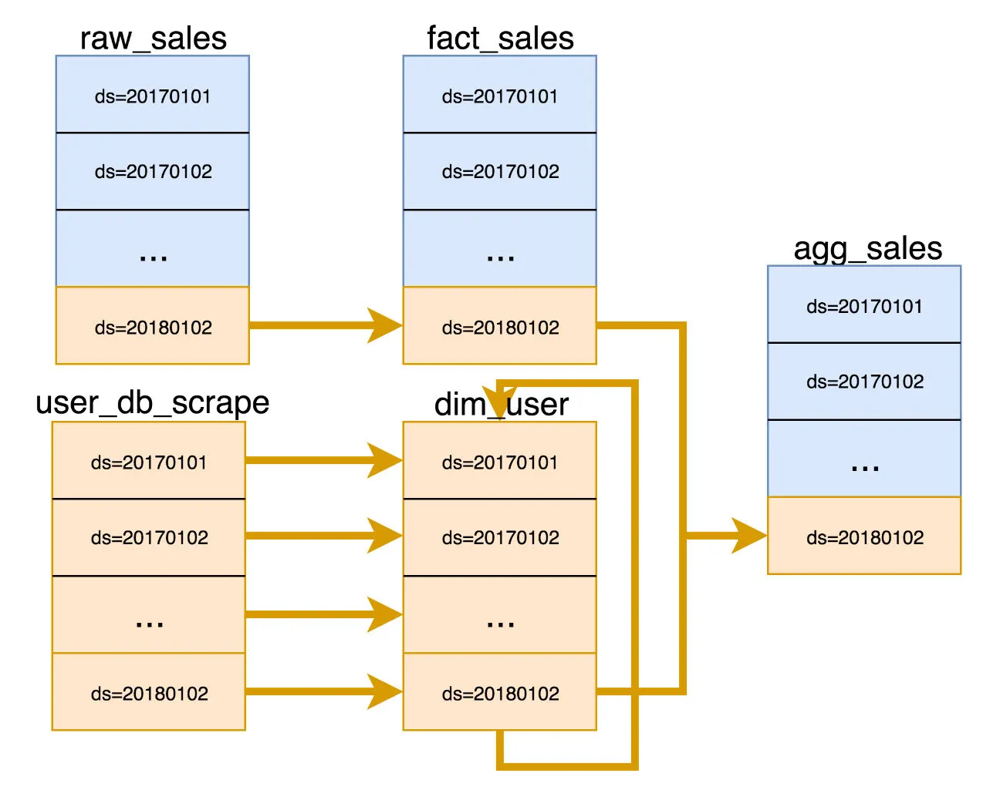
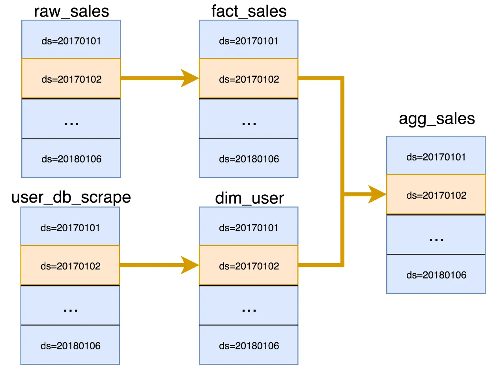
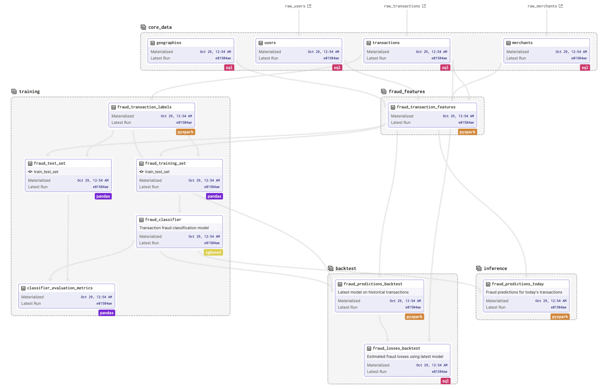
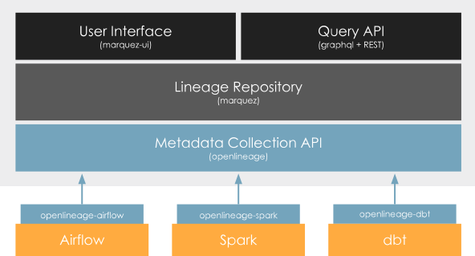
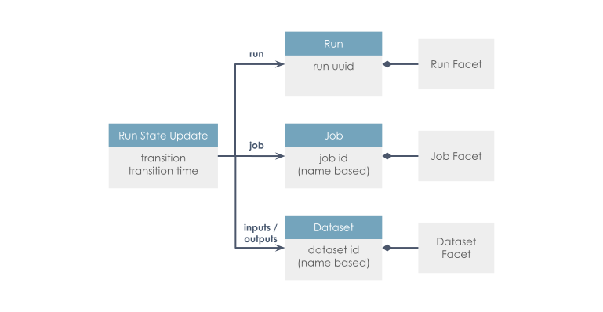
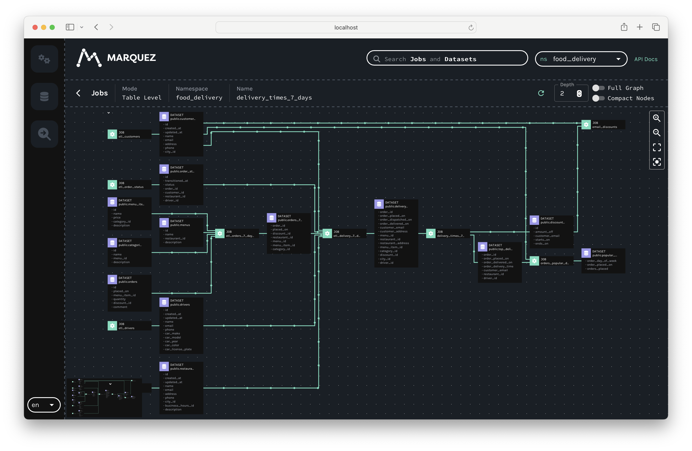

#  {background-image="images/data-processing.png" background-size="cover" style="font-size: 70%;" align="center"}

::: {.newsection style="--h1-banner-color: #E0E5E1AA; --h1-banner-text-color: #222222"}
Patterns for building data & AI systems
:::

## The most common patterns for building data & AI systems


<br>

- **Pipes and filters pattern** for batch data processing flows
- **Layers pattern** for achieving interoperability
- **the hub-and-spoke event broker topology pattern** for federated data systems

## ETL, ELT, DAGs, pipelines, dataflows: it's all the same  {background-color="#ffffff"}




## Business process models are also directed acyclic graphs


<br><br>



## Batch data processing has a strong functional flavour {background-color="#ffffff"}


<br>



::: {.notes}

> Batch processing has a quite strong functional flavor (even if the code is not written in a functional programming language). It encourages deterministic, pure functions whose output depends only on the input and that have no side effects other than the explicit outputs, treating inputs as immutable and outputs as append-only. - Kleppmann & Riccomini, chapter 13

:::

## Why functional data engineering?<br>The problem of slowly changing dimensions {background-color="#ffffff"}


```{=html}
<iframe width="1200" height="800" src="https://en.wikipedia.org/wiki/Slowly_changing_dimension" title="Wikipedia"></iframe>
```

## Why functional data engineering?<br>Immutability, snapshots and partitions {background-color="#ffffff"}


::: {.columns}
::: {.column width="40%"}

:::
::: {.column width="10%"}
:::
::: {.column width="40%"}

:::
:::

::: {.notes}
- Strictly speaking, functional programming paradigm only uses immutable objects.
- It’s possible to use functional practices where the exposed objects are in fact mutable.
- Think of partitions as immutable blocks of data
  - Systematically overwrite partitions to make your tasks functional.
  - A pure task should always fully overwrite a partition as its output.
:::


## Idempotency

:::{.callout-warning}

```
def current_temperature(location: str) -> int:
	return MyWeatherService().get_current_temperature(location)
def non_idempotent_function(location: str, destination: str) -> None:
	with open(destination, ‘w’) as f:
		f.write(current_temperature(location))
```
:::

:::{.callout-tip}

```
def get_temperature(timestamp: str, location: str) -> int:
	return MyWeatherService().get_temperature(location, timestamp)
def idempotent_function(timestamp: str, location: str, destination: str) -> None:
	with open(destination, ‘w’) as f:
		f.write(get_temperature(timestamp, location))
```

:::

## Software-Defined Assets bring it all together


:::{style="font-size: 65%;"}
- **Declarative Nature:** declare the end state of an asset, orchestrator takes care of the execution. Shifts the focus from task execution to asset production.
- **Observability and Scheduling:** enhanced observability into your data assets and allow for advanced scheduling. Easier to understand the state of your assets and when they should be updated.
- **Environment Agnosticism:** environment-agnostic, same asset definitions can be used across different environments, such as development and production, without changes to the asset code.
- **Data Lineage:** clear data lineage, easier to understand data flows and debug issues.
- **Integration with External Tools:** the orchestrator can be integrated with assets generated by other tools such as dbt.
- **Rich Metadata and Grouping:** assets have rich metadata, which is useful for organizing and searching assets.
- **Partitioning and Backfills:** SDAs support time partitioning and backfills out of the box, which is useful for managing historical data and ensuring data consistency.
:::

## Same approach for machine learning pipelines  {background-color="#ffffff"}




## OpenLineage as the standard for metadata collection and data lineage



::: {.columns}
::: {.column}

:::
::: {.column}

:::
:::

## Marquez is the open source reference implementation of OpenLineage





