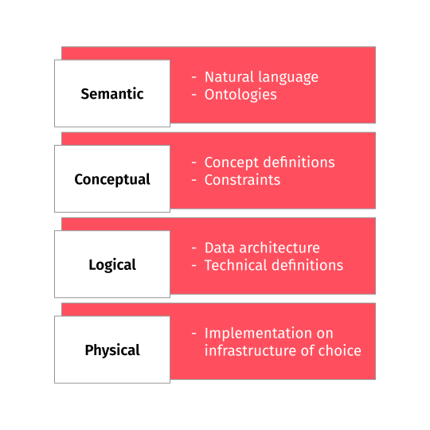
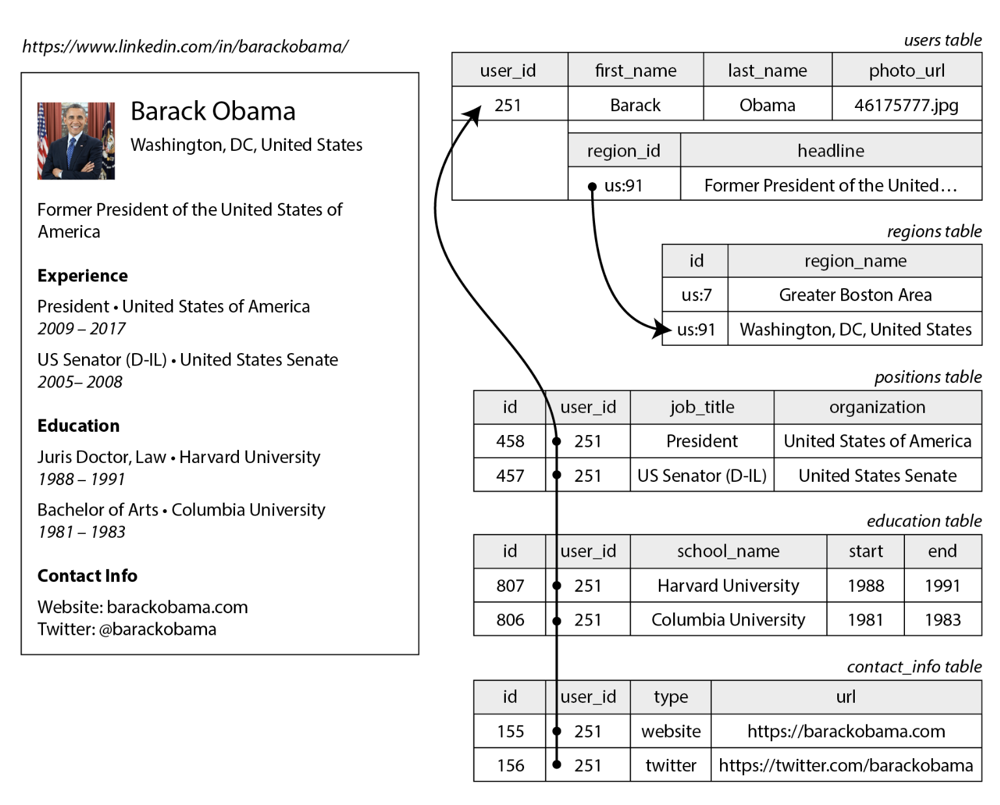
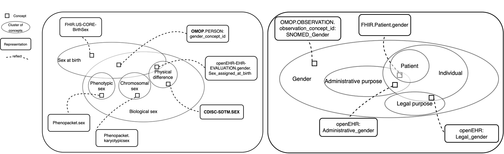

#  {background-image="images/edge-notch-cards.jpg" background-size="cover" style="font-size: 70%;" align="center"}

::: {.newsection style="--h1-banner-color: #000000AA;"}
The relational database
:::

## It all started with the relational database management system (RDBMS) {background-color="#ffffff"}



## Databases are often at the heart of an information system {background-color="#ffffff"}

<br>


## Databases are often at the heart of an information system {background-color="#ffffff"}

<br>


## Relational algebra as the mathematical foundation



## Consider this description of our domain of interest

::: {style="font-size: 80%;"}
- Our company is divided into departments. Each department has a unique name, a unique department number and a department manager. The date this manager started, is registered. Furthermore, a department can be located on multiple locations.
- All employees work for a specific department. Almost everyone has one supervisor, a supervisor may have several employees he is supervisor of. Every employee has a unique number, a name, a birth date, a gender, and a home address.
- An employee works in one or more projects. Each project is controlled by one department, has a unique name and number and is settled on a location. Project members do not necessarily have to work fulltime for a project, but usually a fixed number of hours per week.
- An employee may have several persons that are economically dependent on him: children and/or a spouse/husband. These can be identified by name, have a birth date and a gender. The sort of relationship is denoted as well.
:::

## Chen notation {background-color="#ffffff"}


## Solution {background-color="#ffffff"}


## Four layers of data modeling


:::{.columns}
:::{.column}

:::
:::{.column style="font-size: 80%;"}
<br>

- **Semantic:**<br>fact-based modeling, ontology modeling
- **Conceptual:**<br>Entity-relationship modeling, UML modeling
- **Logical:**<br>dimensional modeling, data vault modeling
- **Physical:** DuckDB, Polars, SQL Server etc.
:::
:::

## Relational models in datawarehouses: the dimensional model (aka star schema)



## Relational models in datawarehouses: the data vault



## The relational model vs. the document model {background-color="#ffffff"}



## The relational model vs. the document model {background-color="#ffffff"}

:::{.columns}
:::{.column width="30%"}

:::
:::{.column width="70%" style="font-size: 80%;"}
<br>
```json
{
  "user_id":     251,
  "first_name":  "Barack",
  "last_name":   "Obama",
  "headline":    "Former President of the United States of America",
  "region_id":   "us:91",
  "photo_url":   "/p/7/000/253/05b/308dd6e.jpg",
  "positions": [
    {"job_title": "President", "organization": "United States of America"},
    {"job_title": "US Senator (D-IL)", "organization": "United States Senate"}
  ],
  "education": [
    {"school_name": "Harvard University",  "start": 1988, "end": 1991},
    {"school_name": "Columbia University", "start": 1981, "end": 1983}
  ],
  "contact_info": {
    "website": "https://barackobama.com",
    "twitter": "https://twitter.com/barackobama"
  }
}
```
:::
:::

## But semantics often get lost in data models<br>Example: different conceptualizations of sex and gender


<br>


