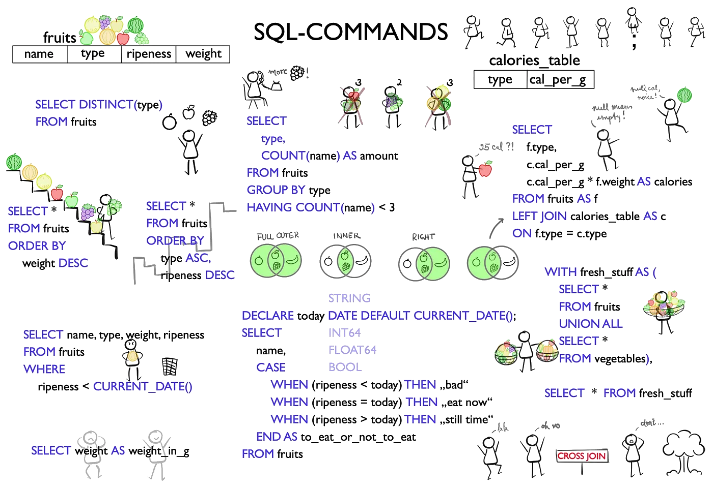
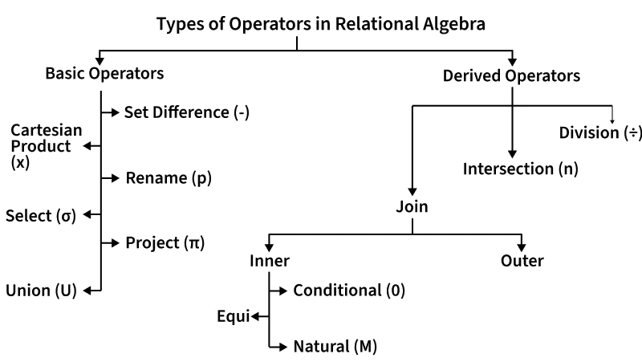
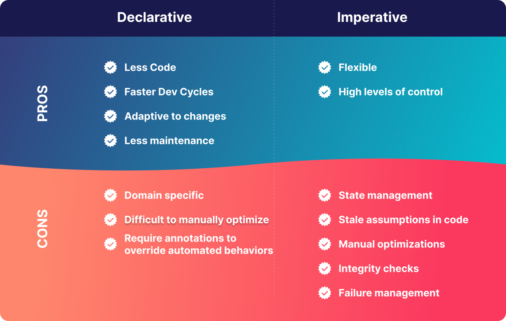

## Dutch open source heroes of relational algebra in the 21st century

::: {.card-grid .cols-2}
::: {.card}

{.r-s}

- Hannes Mühleisen, researcher at Centrum Wiskunde & Informatica (CWI) in Amsterdam
- creator of DuckDB open source database, one of the [most popular](https://duckdb.org/2025/10/09/benchmark-results-14-lts) databases today
- DuckLake makes it possible to build your own performant lakehouse platform 

:::
::: {.card}


:::
:::

:::{.notes}
Ritchie Vink:
- born in Utrecht
- creator of polars open source library
- Polars Cloud launched in 2025
- EUR 20 m investements
- Decathlon France has switched to polars (article 20 December 2025)

Hannes Mühleisen:


:::

## Standard Query Language (SQL) is still the most important language for a data engineer





## A solid mathematical foundation




## Beware when Working with nested data - no standard naming yet ...

<br>

::: {style="font-size: 80%;"}

| operation | ibis | polars | duckdb |
| --- | --- | --- | --- |
| Flatten `Array` into multiple rows | [`ArrayValue.unnest()`](https://ibis-project.org/reference/expression-collections.html#ibis.expr.types.arrays.ArrayValue.unnest) | [`DataFrame.explode()`](https://docs.pola.rs/api/python/stable/reference/dataframe/api/polars.DataFrame.explode.html#polars.DataFrame.explode) | [`UNNEST`](https://duckdb.org/docs/sql/query_syntax/unnest.html) |
| Unnest `Struct` into multiple columns | [`Table.unpack(*columns)`](https://ibis-project.org/reference/expression-tables#ibis.expr.types.relations.Table.unpack) | [`DataFrame.unnest()`](https://docs.pola.rs/api/python/stable/reference/dataframe/api/polars.DataFrame.unnest.html) | [`UNNEST`](https://duckdb.org/docs/sql/query_syntax/unnest.html) |


Ibis also has methods that operate directly on a column of structs:

- [`StructValue.destructure()`](https://ibis-project.org/reference/expression-collections#ibis.expr.types.structs.StructValue.destructure)
- [`StructValue.lift()`](https://ibis-project.org/reference/expression-collections#ibis.expr.types.structs.StructValue.lift)

:::

## Stuff we haven't covered yet<br>...and will definitely give you a headache in future projects

<br>

- [Change Data Capture (CDC)](https://en.wikipedia.org/wiki/Change_data_capture): determine and track data that has changed at the source, such that you only have to process the 'deltas'
- Setup and manage access control mechanisms in an operational data platform
- Provide documentation for non-technical users
- Reporting on data quality


## Imperative vs. declarative programming





## The split-apply-combine strategy for data analysis {background-color="#ffffff"}


<br>


##  Overview data transformations in different libraries

::: {style="font-size: 80%;"}

| concept | pandas | polars | ibis | PySpark | dplyr | SQL |
| --- | --- | ---| --- | --- | --- | --- |
| **split** | groupby() | group_by() | group_by() | groupBy() | group_by() | GROUP BY |
| **combine** | join (), merge() | join() | left_join, inner_join() etc. |  join() | left_join, inner_join() etc. | LEFT JOIN, JOIN etc. |
| **filtering (row based)**| loc[], query() | filter() | filter() | filter() | filter() | WHERE | 
| **select (column based)**| loc[], iloc[],| select() | select() | select() | select() | SELECT | 
| **mutate** | assign() | with_columns() | mutuate() | withColumn() | mutate() | ADD | 
| **ordering** | sort_values() | sort() | order_by() | orderBy() | arrange() | ORDER BY |

:::
## Method chaining makes functional code more readable


<br>

::: {.card-grid .cols-2}
::: {.card style="font-size: 75%;"}

```python
tumble_after(
    broke(
        fell_down(
            fetch(went_up(jack_jill, "hill"), "water"),
            jack),
        "crown"),
    "jill"
)
```
:::
::: {.card style="font-size: 75%;"}
```python
(jack_jill
  .went_up("hill")
  .fetch("water")
  .fell_down("jack")
  .broke("crown")
  .tumble_after("jill")
)
```
:::
:::

## Introducting Software-Defined Assets


