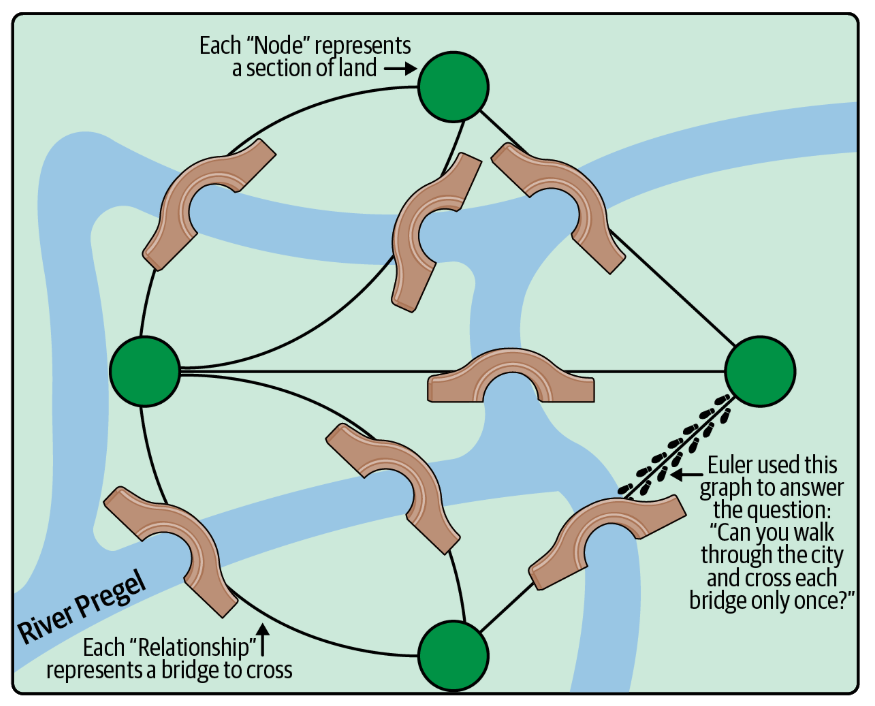
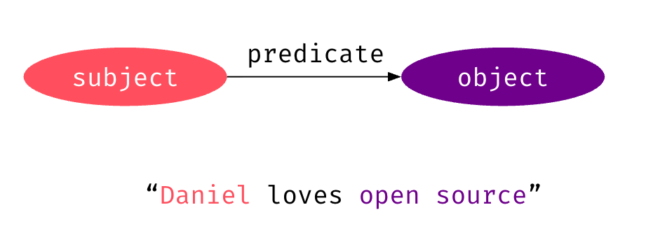
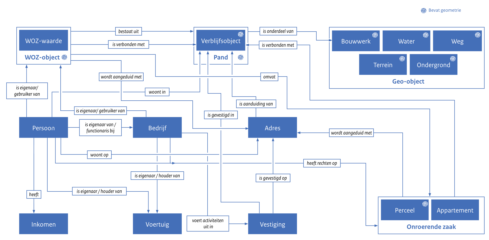

#  {background-image="images/rebecca-hesketh-semantics.png" background-size="cover" style="font-size: 70%;" align="center"}

::: {.newsection style="--h1-banner-color: #000000AA;"}
Bringing semantics back into data engineering
:::

## From data to information and knowledge {background-color="#ffffff"}



## General definition of information {background-color="#ffffff"}


<br>

### Information = Data + Meaning

- multiple data points
- data is well-formed (syntax)
- data is meaningful in a certain context (semantics)

## What is the meaning of this statement?
<br><br><br><br>

::: {style="font-size: 180%;"}
**"Daniel has a high blood pressure"**
:::

## The semantics of blood pressure {background-color="#ffffff"}


<br>


## From data to information


<br>

::: {.list-table style="font-size: 60%;"}
- - Level
  - Dimension
  - Theoretical anchor
  - Example

- - **Data**
  - Signal & Measurement
  - Data is not "raw" but produced by instruments designed under specific physical theories.
  - The voltage fluctuations from the sensor translated into a numerical output (e.g., 145/95).

- - **Information (Statistical)**
  - Entropy & Surprise
  - Shannon Information Theory: The statistical novelty or reduction of uncertainty within a signal, regardless of meaning.
  - A reading of 145 mmHg is "surprising" (high information content) if the patient's historical baseline is 120 mmHg.

- - **Information (Semantic)**
  - Context & Relations
  - Ontologies & Knowledge Graphs: Data structured via schemas to provide meaning (units, subjects, and temporal states).
  - Linking the "145" to "mmHg," "Patient X," and "Resting State" within a standardized medical ontology.

:::

## ... and from information to knowledge


<br>

::: {.list-table style="font-size: 60%;"}
- - Level
  - Dimension
  - Theoretical anchor
  - Example

- - **Knowledge (Propositional)**
  - Justified True Belief (JTB)
  - Classical Epistemology: Knowledge-that. A claim that is believed, is true, and has rigorous justification.
  - The clinician’s belief that "Patient X has hypertension," justified by multiple readings and clinical guidelines.

- - **Knowledge (Procedural)**
  - Non-Propositional Skill
  - Ryle’s "Knowledge-How": The tacit ability to perform a task that cannot be fully captured in formal data structures.
  - The nurse’s skill in correctly placing the cuff and identifying the specific Korotkoff sounds amidst noise.

- - **Knowledge (Acquaintance)**
  - Personal experience
  - familiarity with a person, place, or thing
  - The nurse is familiar with the hospital
:::

## The return of the knowledge graph




## Semantic triples


<br>

:::{.columns}
:::{.column style="font-size: 70%;"}
- A semantic triple, or RDF triple or simply triple, is the atomic data entity in the Resource Description Framework (RDF) data model
- A triple is a sequence of three entities that codifies a statement about semantic data in the form of **subject–predicate–object** expressions
:::
:::{.column }

:::
:::

## Stelselgegevens basisregistraties {background-color="#ffffff"}


<br>



## KIK-V ontology for the Dutch care sector {background-color="#ffffff"}


```{=html}
<iframe width="1200" height="500" src="https://kik-v-publicatieplatform.nl/ontologie/onz-pers/3.0.0"></iframe>
```

## The Ontology Pipeline


:::{.columns}
:::{.column}

:::
:::{.column style="font-size: 70%;"}
**Ontologies** enhance **vocabularies** by describing and contextualizing relationships between concepts and with the introduction of logical reasoning. By assigning classes, properties, relations and attributes, ontologies establish rule bases that define how concepts behave in the wild, ensuring a level of coherence within complex information systems. Machines love ontologies because of their high-fidelity disambiguation and description, which bring clarity to machine understanding for tasks such as information retrieval, entity management, concept discovery, and RAG implementations for AI systems.
:::
:::

## Are graphs the future?

:::{style="font-size: 70%;"}
<br>

### I certainly think so

- Read this comprehensive introduction by [Hogan et al. (2021)](https://dl.acm.org/doi/pdf/10.1145/3447772)
- Labeled property graph (cypher/GQL): try the [neo4j sandbox](https://neo4j.com/sandbox/)
- RDF Triple Store (SPARQL): try the [data.world SPARQL tutorial](https://neo4j.com/sandbox/)

:::{.callout-caution}
- The RDF/SPARQL stack is mostly used by the ontology community
- Labeled Property Graphs as more commonly used by companies
- [Graph Query Language GQL](https://www.gqlstandards.org/) is the new ISO standard, similar to SQL and derived from cypher (neo4j)
- There is also [GraphQL](https://graphql.org/), which is an API format and something completely different from GQL
:::

:::

## SPARQL vs. Cypher/GQL comparison



## Choose your data structure and engine wisely



## The elephant is your friend


:::{.columns}
:::{.column}

:::
:::{.column style="font-size: 70%;"}

<br>

- **One physical engine:** PostgreSQL is the most widely used open source relational database management system
- **Supports different data structures:** not only relational but also document model ([JSONB](https://neon.com/guides/document-store)) and labeled property graph ([Apache AGE](https://age.apache.org/))
- … plus many use-case specific extensions such as time-series database, spatial database etc.
:::
:::
